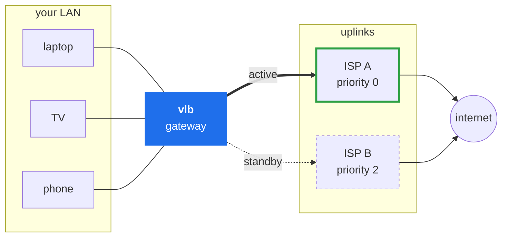
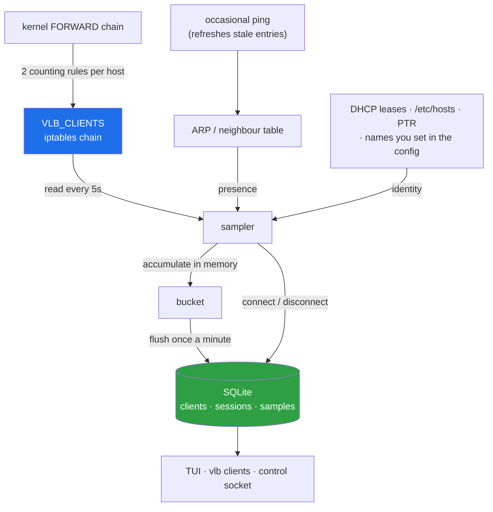
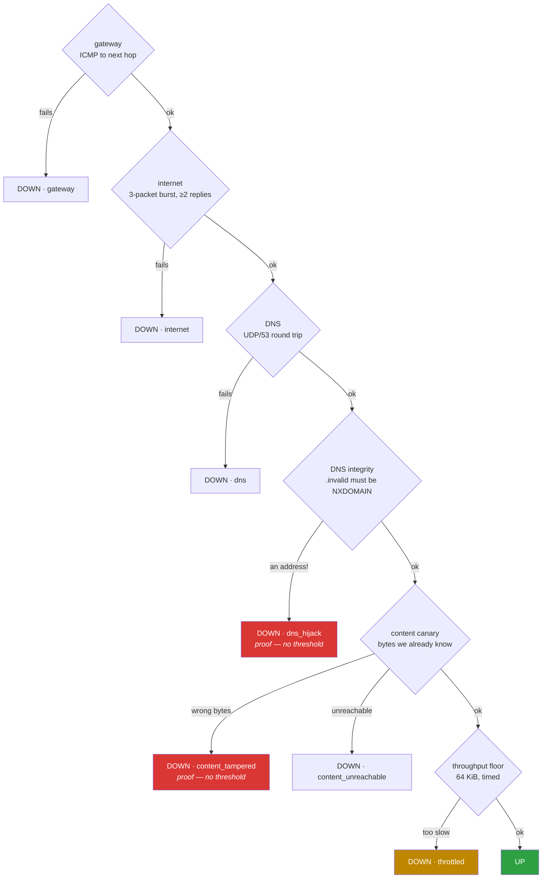
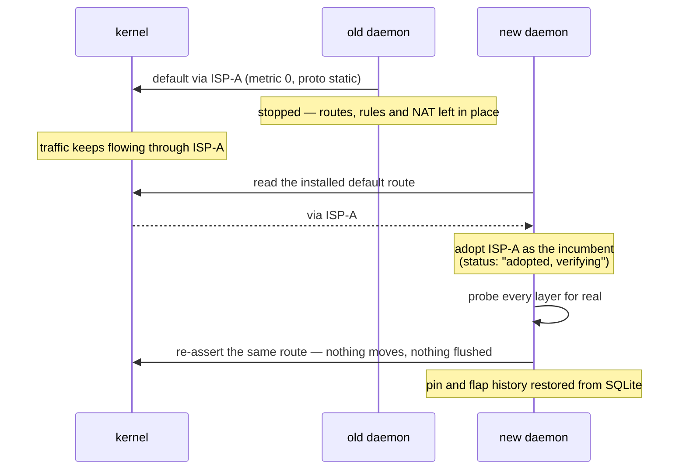

# vlb — Virtual Load Balancer

<p align="center">
  
</p>

<!--
  Once the repo is public, swap the two badges below for the live ones:
  [](https://github.com/DenisHumen/vlb-Virtual-Load-Balancer/actions/workflows/ci.yml)
  [](https://github.com/DenisHumen/vlb-Virtual-Load-Balancer/actions/workflows/release.yml)
-->
[](https://github.com/DenisHumen/vlb-Virtual-Load-Balancer/releases)
[](#runtime-requirements)
[](LICENSE)
[](https://www.rust-lang.org)

Multi-uplink failover gateway for Linux. Turns one box into an active/standby
router across several upstream ISPs: probes every provider independently,
installs the highest-priority healthy one as the kernel default route,
flushes conntrack on switch, and ships a TUI / control protocol / SQLite
stats so you can actually see what's happening.

> **Status:** `0.5.1`. Runs in production, and the failover behaviour is
> covered by a docker lab that breaks the network nine different ways — and
> restarts the daemon under it three more — on every CI run. Still pre-1.0:
> config keys can change between minor versions, and `vlb check` will tell
> you when they do.

<p align="center">
  
</p>

<p align="center"><sub>
  A real failover, frame by frame: the primary is caught serving somebody
  else's bytes, traffic moves to the next uplink, the primary recovers, and
  the route returns only after it has proven itself. Every frame here is
  rendered by the test suite from the same widgets the program draws with.
</sub></p>



`vlb` watches every uplink continuously, moves the default route to a healthy
one the moment the active one stops actually working — not merely stops
answering pings — and tells you who on the LAN was affected.

---

## Get it running

```bash
git clone https://github.com/DenisHumen/vlb-Virtual-Load-Balancer.git
cd vlb-Virtual-Load-Balancer
sudo bash scripts/vlb.sh install
```

That last command is a guided setup: it installs what is missing, works out
which interface faces your network, asks for each uplink's gateway address,
writes the configuration, starts the service and waits until traffic is
actually flowing through a verified uplink. Run it again later and it opens a
menu instead — add an uplink, change one, restart, diagnose.
[More on it below](#guided-setup-and-the-menu).

Prefer a release binary and no build? [One command for that too](#install-or-update-on-a-server).

---

## Contents

| | |
|---|---|
| [Why](#why) · [What it does](#what-it-actually-does) | the pitch |
| [Guided setup](#guided-setup-and-the-menu) · [Install / update](#install-or-update-on-a-server) · [From a checkout](#update-from-a-git-checkout) | getting it running |
| [Client statistics](#who-is-on-the-network--client-statistics) | who is using the link |
| [Configuration](#configuration-reference) · [CLI](#cli) · [TUI](#tui-hotkeys) | day-to-day use |
| [How it works](#how-it-works) · [Failure modes](#failure-modes-we-cover) | the design |
| [Testing](#testing) · [Ubuntu 24.04](#ubuntu-2404) · [Troubleshooting](#troubleshooting) | when things go wrong |

---

## Why

If you have two or more ISPs hooked up to one Linux box, the usual options
are:

* **Multi-WAN routers** — black box, often Lua/UI-only, hard to integrate.
* **Bash + cron + ping** — fine until the day a provider answers ICMP for
  `1.1.1.1` but black-holes everything else.
* **`mwan3` / `keepalived` / OSPF** — overkill for a "one gateway, two
  uplinks" home/office setup, and weak for the failure modes that actually
  bite (DNS-only outages, intermittent ICMP-prohibited, partial blocking).

`vlb` is the in-between: a single binary that probes properly, switches
fast, and gives you a real dashboard.

---

## What it actually does

* **Per-provider, fwmark-bound probes**, all independent of which provider
  currently owns the default route. Each provider gets its own routing
  table (`ip rule fwmark`) so we can verify any uplink any time.
* **Six layers of health checks** per provider:
  1. **Gateway**: ICMP to next-hop on the LAN.
  2. **Internet**: 3-packet ICMP burst (≥2 replies needed) to a list of
     external targets — IPs *and hostnames*. Hostnames are resolved
     through that provider's DNS, so the resolved IP is reachable via the
     same uplink.
  3. **DNS**: explicit UDP/53 round-trip to public resolvers, again
     fwmarked. Catches "ICMP works but DNS is blocked" outages.
  4. **DNS integrity**: a random name under `.invalid` — which RFC 6761
     guarantees can never exist — must come back NXDOMAIN. A resolver that
     invents an address for it is being intercepted.
  5. **Content canary**: fetch a resource whose bytes we already know, over
     that uplink, and compare. See below — this is the one that catches the
     failure mode the others cannot.
  6. **Throughput floor**: move 64 KiB and check the link is not merely
     reachable but actually fast enough to be worth anything.
* **Selectively-prohibited detection**: if any hostname target is
  configured, at least one of them must succeed — so a happy `1.1.1.1`
  reply can't mask an uplink that returns
  `Destination Net Prohibited` for everything else.
* **Interception detection (the content canary).** Reachability probes all
  share one blind spot, and it is the failure mode that hurts most: an ISP
  whose account has lapsed usually does *not* black-hole traffic — it
  intercepts it. DNS answers get rewritten to a payment portal and HTTP
  requests get answered with a billing page, while ICMP is left working. The
  next hop pings, `1.1.1.1` pings, `google.com` resolves and pings (to the
  portal, which answers), DNS returns a well-formed NOERROR. Every
  reachability check passes and the uplink looks perfectly healthy while
  nothing actually works. `vlb` closes that gap by fetching content it
  already knows the answer to: an interceptor can fake reachability for
  free, but it cannot produce bytes it does not have. Wrong content is
  treated as *proof* rather than a symptom, so it bypasses the failure
  threshold and switches on first observation.
* **Deterministic priority-based selection** with separate fail / recover
  thresholds (anti-flap).
* **Default route written as `metric 0 proto static`** so it cleanly
  replaces existing netplan / DHCP defaults instead of coexisting with
  them — failback to the primary actually works.
* **Conntrack flush on every switchover** so live flows reset
  immediately instead of black-holing until TCP timeout.
* **Restarts and updates do not interrupt traffic.** Nothing is torn down
  on shutdown, and the next instance *adopts* the default route it finds
  rather than choosing afresh: the incumbent keeps carrying traffic until
  this process has probed it to a verdict of its own. No route change, no
  conntrack flush, no thirty-second detour through the backup because its
  probes happened to finish first. The operator's pin and the flap history
  survive the restart too. On a cold start — a reboot, where there is no
  route to adopt — it waits the few rounds a better-priority provider needs
  for its verdict instead of installing the first healthy one and switching
  again moments later.
* **Starts even when an uplink's interface is not there yet.** A provider
  whose NIC is late to appear at boot (or gone) is reported down and
  retried every health interval; the others are managed normally.
* **Force / auto control** via TCP control socket (and TUI hotkey `f`):
  pin a specific provider as long as you like; pin survives even when
  the pinned provider is briefly Down (we serve the best healthy one
  meanwhile and snap back when the pin recovers).
* **Per-client statistics.** Every host behind the gateway, by address, MAC
  and name: how much it moved, how long it has been connected, and how many
  times its connection dropped — [with a screen of its own](#who-is-on-the-network--client-statistics).
  Counted by the kernel, stored locally in the same SQLite database, and
  never sent anywhere.
* **SQLite stats** (WAL, indexed) for health checks, traffic, host
  metrics, state changes, failover events and clients. Everything stays on
  the box.
* **TUI dashboard** (ratatui) — provider table, sparklines, traffic and
  CPU/mem graphs, client statistics, hotkeys for force / auto.
* **Dry-run** that validates and prints every system call without doing
  it. Use this before pointing it at production.
* **Hardened config validator** — rejects reserved tables (253/254/255),
  overlong interface names, fwmark of 0, timeouts >= interval, control
  ports listening on non-loopback, and a few dozen more footguns.
* **A guided setup** that installs dependencies, finds the interface, asks
  for each uplink and verifies the result — and, on a machine already
  running, a menu for changing uplinks, restarting and diagnosing.
  [See it](#guided-setup-and-the-menu).

---

## Install (or update) on a server

One command. It downloads the release for your architecture, verifies it
against the published SHA-256, checks the new build accepts your existing
config *before* replacing anything, and restarts the service:

```bash
curl -fsSL https://raw.githubusercontent.com/DenisHumen/vlb-Virtual-Load-Balancer/main/scripts/install.sh | sudo bash
```

Safe to re-run: it is the update path as well as the install path. Your
`/etc/vlb/vlb.toml` is never overwritten. If the new build rejects your config,
cannot reach the canary targets, or the service fails to come back, it rolls
back to the previous binary — and the previous unit — and tells you why.

The restart in the middle does not interrupt traffic. The old daemon leaves
its routes in place and the new one adopts them, re-verifying the active
provider with its own probes before it will consider moving anything. The
installer waits for that verification and reports `carrying traffic via:
isp-main (verified by the new build)`.

It adopts whatever is already there. If a `vlb` systemd unit exists, the
installer reads its `ExecStart` and updates *that* binary with *that* config
— so a box running out of `/opt/vlb` with its config beside it is updated in
place, rather than having a second copy quietly installed at the default
paths while the running one stays stale. A stock unit file is upgraded along
with the binary (the previous one is kept as `vlb.service.bak`); a unit you
edited by hand is left alone with a note. Put local changes in a drop-in
(`sudo systemctl edit vlb`) and they survive every update.

On a machine with no existing config it installs the annotated example and
stops short of starting the service, so it cannot bring up a gateway pointed
at example addresses.

Once installed, the box can update itself with exactly the same safety net:

```bash
sudo vlb update
```

…or from the dashboard (`sudo vlb tui`), press `u`. Both run the new build's
`check` against your config, run its `probe` to confirm the canary quorum is
reachable, swap the binary, restart the service, wait for the daemon to
answer, and roll back if it does not.

<details>
<summary>Options</summary>

| Variable       | Effect                                          |
|----------------|-------------------------------------------------|
| `VLB_VERSION`  | Install a specific tag instead of the latest    |
| `VLB_PRE=1`    | Consider pre-releases                            |
| `VLB_NO_START=1` | Install the binary, leave the service alone    |
| `VLB_SKIP_PROBE=1` | Skip the pre-restart canary reachability check |
| `VLB_REPO`     | Pull from a fork                                 |

```bash
curl -fsSL .../install.sh | sudo VLB_VERSION=v0.2.1 bash
```
</details>

---

## Guided setup and the menu

```bash
sudo bash scripts/vlb.sh install
```

On a machine with no configuration it walks the whole way through:

```text
Dependencies
────────────
[ ok] ip, ping, iptables and conntrack are all present

Which interface faces your LAN and the uplinks?
───────────────────────────────────────────────
  1) ens18      10.0.0.100/10
The default route currently leaves through: ens18
Interface [ens18]:

Uplinks
───────
Add them best first. The first one you enter is the primary; the others are
tried in the order you give them if it fails.

Uplink 1
  Name (no spaces) [isp-main]:
  Gateway (the ISP router's address): 10.0.0.2
[ ok]   10.0.0.2 answers ping
  Interface it is reached on [ens18]:
  Priority (lower wins) [0]:
  Role (primary/backup) [primary]:

Add a backup uplink? (strongly recommended — with one uplink there is
nothing to fail over to) (y/n) [y]:
```

…and finishes by writing `/etc/vlb/vlb.toml`, installing the service, and
waiting until it can say **`carrying traffic through isp-main, verified by
its own checks`**.

Three things it will not do, all learned the hard way:

* **It never leaves a configuration the daemon would reject.** Every change is
  written to a temporary file, validated with the real binary, and only then
  moved over the live one — with the previous version kept beside it. A
  gateway whose config is rejected does not come back.
* **It never leaves root-owned files in your checkout.** Building under `sudo`
  makes `target/` unwritable for your ordinary user afterwards; the build is
  handed back to whoever owns the source tree, and an already-root-owned
  `target/` is given back too.
* **It never answers its own questions.** Reached through a pipe, or run with
  nothing on standard input, it stops and says so rather than accepting every
  default in turn and configuring a gateway nobody asked for.

Run it again on a configured machine and it opens a menu:

```text
  config   /etc/vlb/vlb.toml
  daemon   running (systemd)
  active   isp-main

  1) Status
  2) Dashboard (TUI)
  3) Who is connected (clients)
  4) Uplinks — add, change, remove
  5) Restart
  6) Diagnose a problem
  7) Update from git
  0) Quit
```

Adding an uplink asks the same four questions and checks the answer before
accepting it — an address that is not directly connected cannot be a next
hop, and it says so at the moment you type it rather than leaving you to
find out from the daemon later. **Diagnose** runs the timed per-layer probe,
prints the kernel's own routes and policy rules, and tails the log.

---

## Update from a git checkout

If you run `vlb` straight out of a clone rather than from a release, the
whole update is:

```bash
cd ~/load_balancer && git pull && sudo bash scripts/vlb.sh restart
```

Any `scripts/vlb.sh` command that needs the binary rebuilds it when the
sources are newer — and then **restarts the running daemon**, because a
rebuild on its own leaves the old process in memory serving the old
behaviour. That used to be the confusing half of updating this way: `git
pull` plus a command that clearly rebuilt something, and none of the new
features anywhere to be seen.

The restart does not interrupt traffic (see [How it works](#how-it-works)):
the new process adopts the default route the old one left in the kernel.

```bash
sudo bash scripts/vlb.sh status     # what is running now
sudo bash scripts/vlb.sh tui        # dashboard (rebuilds + restarts if needed)
sudo bash scripts/vlb.sh clients    # who is on the network
sudo bash scripts/vlb.sh install    # the setup menu: uplinks, restart, diagnose
VLB_NO_RESTART=1 bash scripts/vlb.sh build   # rebuild, leave the daemon alone
```

`scripts/vlb.sh` uses `/etc/vlb/vlb.toml` whenever that file exists, and falls
back to the bundled example only when it does not. Keeping the live
configuration out of the tracked example file is what makes `git pull` safe:
edit the example and the next pull either refuses to update or overwrites your
gateway's settings.

The dashboard says so plainly if it is newer than the daemon it is talking
to, rather than showing an empty screen.

---

## Who is on the network — client statistics

Press <kbd>c</kbd> in the dashboard, or run `vlb clients`. Every host behind
the gateway, connected first — and <kbd>Enter</kbd> opens one of them:

<p align="center">
  
  <br />
  <sub>Still frames, easier to read closely:
  <a href="docs/assets/tui-clients.svg">the list</a> ·
  <a href="docs/assets/tui-client-detail.svg">one client</a></sub>
</p>

The detail view is where "was it us or them" gets answered: every connection,
how long each lasted, and **how long the host was away in between**.

<details>
<summary>The same two screens as text, if you prefer to copy from them</summary>

Both are the still frames linked above, at the width they are drawn:
the list at 132x19, one client at 132x26.

```text
┌ clients · window 24h ────────────────────────────────────────────────────────────────────────────────────────────────────────────┐
│5 of 7 hosts connected   now ↓ 53.9 Mbit/s  ↑ 6.2 Mbit/s   total 24h ↓ 5.69 GiB  ↑ 738.68 MiB   11 drops                          │
└──────────────────────────────────────────────────────────────────────────────────────────────────────────────────────────────────┘
┌ hosts (↑/↓ select · Enter for details) ──────────────────────────────────────────────────────────────────────────────────────────┐
│   name             address         mac               ↓ now       ↑ now       ↓ total    ↑ total    online     drops last seen    │
│●  denis-pc         192.168.8.24    a4:5e:60:11:2c:9e 23.6 Mbit/s 2.3 Mbit/s  3.40 GiB   497.37 MiB 4h12m      0     now          │
│●  TV (living room) 192.168.8.31    a4:5e:60:12:2c:97 12.4 Mbit/s 1.5 Mbit/s  774.38 MiB 96.80 MiB  3h28m      2     now          │
│●  —                192.168.8.12    —                 8.4 Mbit/s  1.1 Mbit/s  39.10 MiB  4.34 MiB   2h44m      0     now          │
│·  iphone-anna      192.168.8.57    a4:5e:60:14:2c:89 0.0 bit/s   0.0 bit/s   210.29 MiB 21.03 MiB  1h00m      5     37m00s ago   │
│●  nas              192.168.8.9     a4:5e:60:15:2c:82 5.1 Mbit/s  720.0 kbit/ 1.20 GiB   111.32 MiB 1h16m      0     now          │
│●  work-laptop      192.168.8.44    a4:5e:60:16:2c:7b 4.3 Mbit/s  614.4 kbit/ 91.93 MiB  7.66 MiB   32m00s     1     now          │
│·  printer          192.168.8.71    a4:5e:60:17:2c:74 0.0 bit/s   0.0 bit/s   2.00 MiB   157.75 KiB 1h00m      3     37m00s ago   │
│                                                                                                                                  │
│                                                                                                                                  │
└──────────────────────────────────────────────────────────────────────────────────────────────────────────────────────────────────┘
┌──────────────────────────────────────────────────────────────────────────────────────────────────────────────────────────────────┐
│↑/↓ select  Enter details  w window (24h)  r refresh  c/Esc back to providers  q quit                                             │
│traffic is counted in the kernel per host; "online" comes from the ARP table, refreshed by an occasional ping                     │
└──────────────────────────────────────────────────────────────────────────────────────────────────────────────────────────────────┘
```

```text
┌ client 192.168.8.24 ─────────────────────────────────────────────────────────────────────────────────────────────────────────────┐
│denis-pc   192.168.8.24   a4:5e:60:11:2c:9e                                                                                       │
│● online  connected for 4h12m                                                                                                     │
│traffic   ↓ 3.40 GiB   ↑ 497.37 MiB   over the last 24h                                                                           │
│average   ↓ 921.9 kbit/s   ↑ 131.7 kbit/s   while connected                                                                       │
│peak      ↓ 39.8 Mbit/s   ↑ 4.3 Mbit/s                                                                                            │
│connected 8h48m of 24h  (36.7%)   drops 2   longest 4h36m   first seen 01-12 09:41                                                │
└──────────────────────────────────────────────────────────────────────────────────────────────────────────────────────────────────┘
┌ traffic · 01-14 09:56 → 01-15 09:41 ─────────────────────────────────────────────────────────────────────────────────────────────┐
│45.7 Mbit/s│                                                                                                                   ⣀  │
│           │                                                                        ⢰⠢⠤⣀                ⡔⠊⠉⡆                 ⡠⠊ ⠑⢄│
│           │                                                                        ⡸   ⠉⠢⡀           ⡠⠊   ⢇ ⢰⠢⣀           ⢀⠔⠁    │
│22.9 Mbit/s│                                                                        ⡇     ⠈⢢        ⣀⠜     ⢸ ⡎  ⠱⡀      ⢀⠤⠒⠁      │
│           │                                                                        ⡇       ⠑⢄⡀ ⢀⠤⠒⠊       ⢸⢀⠇   ⠈⠢⡀  ⡠⠊⠁         │
│           │                                                                       ⢠⠃         ⠈⠑⠊          ⠘⣼      ⠑⠢⠜            │
│0          │⣀⣀⣀⣀⣀⣀⣀⣀⣀⣀⣀⣀⣀⣀⣀⣀⣀⣀⣀⣀⣀⣀⣀⣀⣀⣀⣀⣀⣀⣀⣀⣀⣀⣀⣀⣀⣀⣀⣀⣀⣀⣀⣀⣀⣀⣀⣀⣀⣀⣀⣀⣀⣀⣀⣀⣀⣀⣀⣀⣀⣀⣀⣀⣀⣀⣀⣀⣀⣀⣀⣀⣀⠔⠒⠒⠒⠒⠢⠤⠤⠤⠤⠤⠤⠤⠒⠒⠒⠒⠒⠒⠒⠊⠉⠉⠱⡠⠊⠉⠑⠒⠒⠒⠒⠒⠒⠒⠤⠤⠤⠤⠤⠤⠔⠒⠒⠒⠒│
└──────────────────────────────────────────────────────────────────────────────────────────────────────────────────────────────────┘
┌ connections (newest first · "away before" is the gap) ───────────────────────────────────────────────────────────────────────────┐
│started               ended                 duration    away before   ↓            ↑                                              │
│2026-01-15 05:29:07   — still connected     4h12m       12m18s        1.62 GiB     237.38 MiB                                     │
│2026-01-15 00:40:49   2026-01-15 05:16:49   4h36m       2m00s         1.78 GiB     259.99 MiB                                     │
└──────────────────────────────────────────────────────────────────────────────────────────────────────────────────────────────────┘
┌──────────────────────────────────────────────────────────────────────────────────────────────────────────────────────────────────┐
│↑/↓ next host  Esc back to the list  w window (24h)  r refresh  q quit                                                            │
│                                                                                                                                  │
└──────────────────────────────────────────────────────────────────────────────────────────────────────────────────────────────────┘
```

</details>

> Every picture in this file is rendered by the test suite from the real
> widgets, and that is checked rather than asserted: an ordinary `cargo test`
> rebuilds all five and fails if what is committed differs by a byte. It also
> reads each one back and compares it, row by row, with the terminal buffer it
> came from. Regenerate them with
> `VLB_SHOTS=1 cargo test --bin vlb tui::tests::render_readme_assets`.


### The same thing from the shell

```bash
sudo vlb clients                          # the list
sudo vlb clients --hours 168              # a week instead of a day
sudo vlb clients --ip 192.168.8.24        # one host's full history
sudo vlb clients --json | jq '.clients[]' # for scripts
```

### Where the numbers come from



Three deliberate choices behind that picture:

* **The kernel does the counting.** Two rules per host in a chain of our
  own — `-s <ip>` and `-d <ip>`, with no `-j` target, so they count and fall
  through. Nothing is sampled, nothing is estimated, and a flow that ends
  does not take its bytes with it. NAT is not in the way: masquerading
  happens later, in `POSTROUTING`, so the host's own address is visible in
  both directions.
* **Presence is ARP, nudged.** A host that has been quiet for half a minute
  goes `STALE` in the neighbour table, which looks exactly like a host that
  has left. So stale neighbours get an occasional ping — and even one that
  drops ICMP has to answer the ARP request that precedes it, which is what
  refreshes the entry. Without this every idle laptop would show a
  disconnection every minute.
* **Sample fast, write slowly.** Presence and rates are read every few
  seconds; traffic is accumulated in memory and written once a minute, and
  only when it is not zero. Presence costs two rows per connection rather
  than one per tick. A gateway that runs for a year does not need a database
  the size of its logs.

One gap worth knowing about: a host is counted from the moment it is
*discovered*, so a machine nobody has ever seen before can move up to one
sampling interval of traffic before its rules exist. It applies once per
host — the rules stay in place when a client goes quiet, and across daemon
restarts, so a returning laptop is counted from its first packet. The
alternative, pre-creating rules for every address on the segment, is how a
ruleset grows without bound on a network with a guest wifi.

### Names

In priority order — the first one that knows wins:

| Source | Set up |
|---|---|
| Your own label | `[[clients.names]]` in the config, keyed by MAC or IP |
| DHCP lease | automatic, if dnsmasq / OpenWrt / Kea runs on this box |
| `/etc/hosts` | automatic |
| Reverse DNS | automatic, via the system resolver (`resolve_hostnames`) |

A machine nobody can name shows as `—` and is still counted; it is
identified by its address and MAC.

```toml
[[clients.names]]
name = "Denis PC"
mac  = "a4:5e:60:11:22:33"   # survives a changed lease

[[clients.names]]
name = "NAS"
ip   = "192.168.8.9"
```

### What is *not* a client

Provider gateways, this machine's own addresses, broadcast and multicast are
excluded automatically — an ISP's router sharing the LAN segment is not one
of your users. Anything else you do not want counted (a managed switch, an
access point) goes in `clients.exclude`.

### Turning it off

Client accounting installs one iptables chain. If you told vlb not to manage
your firewall (`firewall.manage = false`) it does not install anything unless
you ask for it explicitly:

```toml
[clients]
enabled = false     # or true, to account even with firewall.manage = false
```

`vlb check` prints which of the two you have.

---

## Quick start (development host)

```bash
# 1. clone, build
git clone https://github.com/DenisHumen/vlb-Virtual-Load-Balancer.git
cd vlb-Virtual-Load-Balancer
./scripts/vlb.sh build         # bootstraps rustup if needed

# 2. copy and edit the config
cp examples/vlb.example.toml vlb.toml
$EDITOR vlb.toml

# 3. validate it
./scripts/vlb.sh check

# 4. dry-run the daemon (no system mutation)
sudo VLB_CONFIG=$PWD/vlb.toml ./scripts/vlb.sh run --dry-run   # Ctrl+C to stop

# 5. real run, daemonised
sudo VLB_CONFIG=$PWD/vlb.toml ./scripts/vlb.sh start
sudo VLB_CONFIG=$PWD/vlb.toml ./scripts/vlb.sh tui    # dashboard
sudo VLB_CONFIG=$PWD/vlb.toml ./scripts/vlb.sh logs   # tail logs
sudo VLB_CONFIG=$PWD/vlb.toml ./scripts/vlb.sh stop
```

The launcher is documented inline (`./scripts/vlb.sh help`).

---

## Production install (systemd)

```bash
sudo ./scripts/vlb.sh install-service
# → installs /usr/local/bin/vlb,
#   /etc/systemd/system/vlb.service,
#   /etc/vlb/vlb.toml (your current config),
#   enables and starts the unit.

# Operate via systemd
sudo systemctl status vlb        # one-line summary: active provider, per-provider state, pin
sudo journalctl -u vlb -f
sudo systemctl restart vlb       # traffic keeps flowing; the route is adopted, not re-chosen

# Or talk to the running daemon directly
vlb --config /etc/vlb/vlb.toml status
vlb --config /etc/vlb/vlb.toml tui
vlb --config /etc/vlb/vlb.toml stats --hours 24
```

The unit is written for a gateway, and the choices are deliberate:

| Setting                         | Why                                                                 |
|---------------------------------|---------------------------------------------------------------------|
| `After=network.target`          | *not* `network-online.target`: that one waits for every uplink, so a dead ISP at boot would delay the failover daemon by up to two minutes |
| `StartLimitIntervalSec=0`       | systemd's default gives up after five failures in ten seconds; a gateway daemon is never given up on |
| `Restart=always`, `RestartSec=2`| any exit — clean or not — is followed by a restart, and the routes it left are adopted |
| `Type=exec`                     | `systemctl start` fails if the binary cannot be executed, instead of reporting success |
| `NotifyAccess=main`             | the daemon writes its status line into `systemctl status` |
| `OOMScoreAdjust=-900`           | the process routing the site is the last one the OOM killer should pick |
| `ProtectSystem=full` + `ReadWritePaths=-/etc/sysctl.d` | hardening, with the one write the daemon needs: persisting `ip_forward=1` so forwarding is on from early boot |

To change anything, use a drop-in rather than editing the file — the
installer upgrades the stock unit on update and leaves an edited one alone:

```bash
sudo systemctl edit vlb      # e.g. [Service] Environment=RUST_LOG=debug
```

Uninstall with `sudo ./scripts/vlb.sh uninstall-service` (keeps
`/etc/vlb` and the stats DB intact).

---

## Docker / Docker Compose

The container needs `--network host` and `--cap-add NET_ADMIN` (the
daemon manages routes, ip rules, iptables and policy routing — none of
that works in a default container netns).

```bash
# Build and start (compose file lives in ./docker)
docker compose -f docker/docker-compose.yml up -d --build

# Tail
docker compose -f docker/docker-compose.yml logs -f

# TUI inside the container
docker compose -f docker/docker-compose.yml exec vlb \
    vlb --config /etc/vlb/vlb.toml tui

# Stop
docker compose -f docker/docker-compose.yml down
```

`docker/docker-compose.yml` mounts `./vlb.toml` read-only and persists the
stats DB under `./data/`. See [`docker/Dockerfile`](docker/Dockerfile) and
[`docker/docker-compose.yml`](docker/docker-compose.yml) for the full picture.

A pre-built image will be published to Docker Hub later; for now the
compose file builds locally.

---

## Configuration reference

Full annotated example: [`examples/vlb.example.toml`](examples/vlb.example.toml). Most
deployments only edit `[general]` and `[[providers]]`.

```toml
[general]
lan_interface   = "ens18"        # interface that fronts your LAN clients
gateway_address = "10.0.0.100"   # this box's own LAN IP

[health]
interval_secs       = 3
timeout_ms          = 1000
failure_threshold   = 2          # ticks down before declaring DOWN
success_threshold   = 2          # ticks up before declaring UP
probe_targets       = ["1.1.1.1", "8.8.8.8", "google.com"]
dns_check_enabled   = true
dns_resolvers       = ["1.1.1.1", "8.8.8.8"]
dns_check_name      = "cloudflare.com"

[routing]
table_base  = 200                # provider tables: 200, 201, ...
fwmark_base = 0x200              # provider marks:  0x200, 0x201, ...
rule_pref   = 32000              # ip rule preference

[firewall]
manage                 = true    # write iptables MASQUERADE / mangle rules
disable_host_firewall  = false   # leave UFW etc. alone

[database]
path = "/var/lib/vlb/stats.db"

[canary]                         # content authenticity — see below
enabled         = true
interval_secs   = 10
timeout_ms      = 4000
quorum          = "majority"     # any | majority | all
failure_threshold = 2

[[canary.targets]]
url = "http://connectivitycheck.gstatic.com/generate_204"
expect_status = 204

[[canary.targets]]
url = "https://raw.githubusercontent.com/DenisHumen/vlb-Virtual-Load-Balancer/main/canary/canary.txt"
expect_contains = "vlb-canary-v1-do-not-edit"

[failover]
failback_stable_secs     = 30    # primary must be clean this long before we return
flap_threshold           = 3     # switches inside flap_window before backoff kicks in
flap_window_secs         = 600
max_failback_stable_secs = 900
route_watchdog_secs      = 15    # re-assert our default route if something else took it

[control]
listen = "127.0.0.1:7650"        # control socket; loopback only

[traffic]
enabled         = true
interval_secs   = 2
retention_hours = 72

[system]
enabled         = true
interval_secs   = 2
retention_hours = 72
per_core        = true

[[providers]]
name      = "isp-main"
gateway   = "10.0.0.2"
interface = "ens18"
priority  = 0                    # lower wins
role      = "primary"

[[providers]]
name      = "isp-backup"
gateway   = "10.0.0.1"
interface = "ens18"
priority  = 2                    # gaps are fine — see below
role      = "backup"
```

### Priorities

Lowest number wins. Priorities only have to be **unique** — they do not need
to start at 0 and gaps are allowed. `0` and `2` with nothing at `1` is a
perfectly good configuration, and leaving a gap is useful: you can slot in a
third uplink later without renumbering, which would otherwise move an
existing provider's routing table and fwmark (`table = table_base + priority`,
`mark = fwmark_base + priority`).

### Canary targets

Each target names a URL, the status code you expect, and optionally what the
body must look like. Set **exactly one** of:

| Field             | Meaning                                                        |
|-------------------|----------------------------------------------------------------|
| `expect_contains` | Body must contain this marker. Robust to line-ending changes.   |
| `expect_exact`    | Body must equal this string byte for byte.                      |
| `expect_sha256`   | SHA-256 of the body, 64 hex chars. Strictest.                   |
| *(none)*          | Only the status code is checked — for `generate_204`-style endpoints. |

The shipped defaults deliberately mix schemes, so that no single failure can
both cause a false failover and hide a real one:

* the two **plain-HTTP** endpoints are the standard captive-portal probes
  (what Android and Firefox use). Plain HTTP is precisely what an
  intercepting ISP rewrites, so these trip first and loudest;
* the **HTTPS** endpoint additionally proves the certificate chain — a
  transparent proxy cannot present a valid certificate for
  `raw.githubusercontent.com`, so it fails the handshake rather than serving
  a portal page.

`quorum = "majority"` (the default) means one endpoint being unavailable is
tolerated, while an interceptor — which necessarily breaks all of them —
still trips the check. Two failure kinds are distinguished:

* **tampered** — proof that something is answering in place of the real
  server. Overrides the quorum entirely: one tampered target takes the
  provider down immediately, with no threshold.
* **unreachable** — something failed, but benign explanations exist. Counts
  as a single vote and must repeat `failure_threshold` times.

Where the line falls matters, because `tampered` is powerful enough for one
endpoint to fail every uplink over on its own. Only signals that cannot occur
on a healthy link qualify:

| Observation                                  | Verdict     |
|----------------------------------------------|-------------|
| 3xx redirect                                 | tampered    |
| 511 Network Authentication Required          | tampered    |
| 2xx, but not the expected one                | tampered    |
| Expected status, wrong body                  | tampered    |
| Public hostname resolving into RFC1918/CGNAT | tampered    |
| **4xx / 5xx**                                | unreachable |
| Timeout, refused, TLS handshake failure      | unreachable |

The 4xx/5xx row is deliberate. Interceptors serve payment pages, not 404s, so
a 4xx overwhelmingly means a wrong URL or a broken endpoint — and treating a
typo'd canary URL as proof would fail over every provider at once on a
perfectly healthy network.

> Disabling the canary (`enabled = false`) removes the **only** check capable
> of detecting a reachable-but-intercepted uplink. `vlb check` and the daemon
> both warn when it is off.

### Throughput floor — the case content checking cannot see

Verifying content proves the bytes are genuine. It says nothing about how
*fast* they arrived, and a provider suspending an account may simply cap the
rate rather than redirect or drop.

It is worse than "small transfers are fast enough". A rate limiter is a token
bucket, so a small transfer drains the burst allowance and completes at **full
line speed**. Measured against a 64 kbit/s policer in the test lab:

| Transfer over the same throttled link | Time    | Effective rate |
|---------------------------------------|---------|----------------|
| the 1.2 KB canary file                | 0.6 ms  | ~16 Mbit/s (!) |
| a 256 KB transfer                     | 12.3 s  | 60 kbit/s      |

So no latency budget on the small probe could ever fire. `vlb` moves 64 KiB
twice a minute instead — under a kilobyte per second on average — and fails
the provider if the measured rate is below `min_kbps`.

The default floor of 128 kbit/s is deliberately low: a suspension throttle is
64–128 kbit/s, while any working link clears it comfortably. Round-trip time
alone caps the *measured* figure (64 KiB over a 100 ms RTT reads as roughly
5 Mbit/s however fast the pipe is), so a high floor would fail healthy
providers over — validation refuses anything above 5000. Run `vlb probe` to
see what your links actually report before changing it.

The probe runs only when the reachability layers pass; there is nothing to
learn about the speed of a link that is already down, and firing a 64 KiB
transfer at one would just delay the failover.

### Failback policy

Leaving a broken uplink is immediate and unconditional — users are offline
now, so any healthy provider beats the one we are on. Coming *back* is the
opposite: nothing is broken, so `vlb` waits until the higher-priority
provider has passed **every** layer continuously for `failback_stable_secs`.
If a link proves unstable — more than `flap_threshold` switches inside
`flap_window_secs` — that wait doubles for each extra switch, capped at
`max_failback_stable_secs`, and decays on its own once the link settles.

### Client accounting

Full walk-through in [Client statistics](#who-is-on-the-network--client-statistics).
The knobs:

| Key | Default | What it changes |
|---|---|---|
| `enabled` | follows `firewall.manage` | Whether the accounting chain is installed at all |
| `interval_secs` | `5` | How often presence and counters are read |
| `persist_every_secs` | `60` | How often accumulated traffic is written to SQLite |
| `offline_after_secs` | `180` | Silence before a host counts as disconnected — must be ≥ 3× the interval, or one missed ARP reply becomes a "drop" in the history |
| `retention_hours` | `168` | How long per-host history is kept (the roster of known hosts is never pruned) |
| `presence_probe` | `true` | Ping stale neighbours so an idle host is not reported as gone |
| `resolve_hostnames` | `true` | Reverse-lookup names through the system resolver |
| `max_tracked` | `512` | Ceiling on hosts that get accounting rules |
| `lease_files` | dnsmasq, OpenWrt, Kea | Where to read DHCP hostnames from |
| `exclude` | — | Addresses that are never clients |
| `[[clients.names]]` | — | Your own labels, keyed by `mac` or `ip` |

### Probe target rules

* IPv4 literal (e.g. `1.1.1.1`) → ping it directly through the
  provider's mark.
* Anything else → treated as a hostname, resolved via that provider's
  DNS resolvers (also marked), then ping the resolved IP through the
  same mark.
* Mix both. If at least one hostname is configured, at least one
  hostname must pass — so `google.com` failing while `1.1.1.1` works
  still counts as a broken uplink.

---

## CLI

Everything below assumes the config is at `/etc/vlb/vlb.toml`, which is where
the guided setup puts it and what `scripts/vlb.sh` picks up automatically.

| I want to… | Command |
|---|---|
| Set it up, or change it | `sudo bash scripts/vlb.sh install` |
| See what is happening | `sudo vlb tui` |
| Check it from a script | `sudo vlb status` |
| See who is on the network | `sudo vlb clients` |
| See one host's history | `sudo vlb clients --ip 192.168.8.24` |
| Find out why an uplink is down | `sudo vlb probe --provider isp-main` |
| Pin one uplink by hand | `sudo vlb force isp-backup` … `sudo vlb auto` |
| Restart without dropping traffic | `sudo systemctl restart vlb` |
| Update | `sudo vlb update` — or `git pull && sudo bash scripts/vlb.sh restart` |
| Read the logs | `sudo journalctl -u vlb -f` |

```
vlb run    [--config <path>] [--dry-run]    # foreground daemon
vlb check  [--config <path>]                # validate + summary
vlb status [--config <path>]                # query running daemon
vlb tui    [--config <path>]                # dashboard
vlb force  [--config <path>] <name>         # pin provider
vlb auto   [--config <path>]                # release pin
vlb stats  [--config <path>] [--hours N] [--recent N]
vlb system [--config <path>] [--recent N]
vlb diag   [--config <path>]                # interfaces, DB, ports
vlb probe  [--config <path>] [--provider <name>] [--repeat N]
vlb clients [--config <path>] [--ip <addr>] [--hours N] [--json]
vlb update [--config <path>] [--check] [--pre] [--yes] [--force] [--skip-probe]
```

`vlb status` is JSON, meant for scripts. Besides the per-provider table it
carries `active`, `forced` (the pin), `active_adopted` (the route was taken
over at startup and the new process has not confirmed its provider yet),
`kernel_route` (what the kernel actually has), `failback_pending` (the
countdown, if one is running), `version` and `started_at`.

### `vlb probe` — size your timeouts from measurements

Runs every health layer once against each provider and prints what each one
actually cost, without touching the routing table. Use it to pick
`canary.timeout_ms` instead of guessing, and to see *why* a provider is
considered unhealthy:

```bash
sudo vlb --config /etc/vlb/vlb.toml probe --repeat 5
```

It reports the slowest observed run per layer — the number a timeout has to
accommodate — and suggests a `canary.timeout_ms`. Under an intercepted
uplink it names the interception explicitly rather than reporting a vague
timeout.

### `vlb update` — install the newest release

```bash
sudo vlb --config /etc/vlb/vlb.toml update --check   # look, change nothing
sudo vlb --config /etc/vlb/vlb.toml update           # install, with a prompt
```

In order, and nothing on the box changes until step 4 has passed:

1. downloads the release asset for this host's architecture and verifies it
   against the published SHA-256;
2. proves the new binary runs here (`--version`);
3. runs the new binary's `check` against the config in use — a release that
   tightened validation is caught while the working binary is still in
   place, not after the restart with the gateway down;
4. runs the new binary's `probe` and refuses to continue if the canary
   quorum cannot be met through any provider, since restarting into that
   would switch automatic failover off (`--skip-probe` overrides);
5. swaps the binary atomically, keeping the previous one as `vlb.bak`;
6. restarts the unit and waits for the daemon to answer on its control
   socket. If the service dies, the previous binary is put back and
   restarted.

The restart itself does not touch the routing table: the new daemon adopts
the route the old one left and re-verifies its provider before it would
move anything. The same flow is on the TUI's `u` key, with progress shown
while it runs.

---

## TUI hotkeys

<p align="center">
  
</p>

| Key     | Action                                    |
|---------|-------------------------------------------|
| `↑`/`↓` | Move selection                            |
| `f`     | Force the selected provider               |
| `a`     | Release force, return to auto             |
| `c`     | **Client statistics** — who is on the LAN |
| `r`     | Force redraw                              |
| `u`     | Check for a new release and install it    |
| `q`     | Quit                                      |

On the client screens:

| Key     | Action                                    |
|---------|-------------------------------------------|
| `↑`/`↓` | Move between hosts                        |
| `Enter` | Open one host's full history              |
| `w`     | Cycle the window: 1h → 24h → 7d → 30d     |
| `Esc`   | Back (detail → list → dashboard)          |

Top to bottom: the **gateway** panel (active provider and whether it is
verified or still adopted from the routing table, the pin, the failback
countdown, the kernel's own default route, daemon version and uptime), host
metrics, the **providers** table (state, latency, canary, throughput, how
long each has been up, and *why* one is down), **recent events** — every
switchover with its timestamp and reason — and the traffic chart for the
selected provider. The TUI keeps running through a daemon restart and says
so when the daemon is back.

---

## How it works

For each provider we install one routing table (`ip route add default via
<gw> dev <if> table <N>`), one fwmark policy rule (`ip rule add fwmark
<M> lookup <N>`), and one MASQUERADE rule on egress. Health probes set
`SO_MARK` (DNS) or pass `-m <mark>` (ping), so they always exit through
the chosen provider regardless of the active default. The state machine
counts consecutive successes/failures, picks the lowest-priority healthy
provider as active, and writes the result via `ip route replace default
via <chosen> metric 0 proto static`. On every change we `conntrack -F`
so live flows reset and reconnect.

### One health round, per provider

Each layer only runs when the one before it passed — there is nothing to
learn from a DNS query down a cable that is unplugged, and a 64 KiB transfer
down a dead link costs a whole timeout for no information.



The two red boxes are *proof* rather than symptoms: no working link returns
somebody else's bytes, so those bypass the failure threshold and switch on
first observation. Everything else has to repeat before it counts.

### A restart, or an update

Nothing is torn down when the daemon stops, and the next one picks up where
it left off rather than starting from an empty table:



No route change, no conntrack flush, no detour through the backup because
its probes happened to finish first.

---

## Failure modes we cover

| Symptom                                              | Detected by                |
|------------------------------------------------------|----------------------------|
| ISP cable / next-hop dead                            | gateway probe              |
| Uplink up, packet loss to internet                   | ICMP burst (≥2 of 3)       |
| Selectively allowed: `1.1.1.1` OK, `google.com` fails | hostname probe is mandatory |
| ICMP works, UDP/53 blocked (unpaid account, portal)  | dedicated DNS probe        |
| Intermittent `Destination Net Prohibited` flapping   | 3-packet burst, errors don't count as `received` |
| Sysctl `ip_forward=0`                                 | startup check (when `firewall.manage = true`) |
| Stale conntrack after switch                          | `conntrack -F` on every change |
| Two coexisting default routes (DHCP + ours)           | `metric 0 proto static`, plus removal of any rival at metric 0 — `replace` alone keys on proto and leaves those in place |
| **Account unpaid: DNS hijacked to a portal**          | **DNS integrity probe (`.invalid` must be NXDOMAIN)** |
| **Account unpaid: HTTP answered by a billing page**   | **content canary (bytes compared, redirects rejected)** |
| **Transparent TLS proxy**                             | **canary certificate validation fails the handshake** |
| **Account unpaid: rate-limited to a trickle**         | **throughput floor (64 KiB probe; small probes fit inside the limiter's burst and are useless)** |
| **Hostname resolves into RFC1918 / CGNAT space**      | **canary rejects the answer before even connecting** |
| External tool replaces our default route (DHCP renew) | route watchdog re-installs it |
| A provider that keeps bouncing up and down            | failback stability window + flap backoff |
| **Daemon restart / update while traffic is flowing**  | **the installed route is adopted and kept until its provider has a verdict; no flush, no detour through the backup; the pin and the flap history are persisted** |
| **An uplink's interface absent at boot**              | **that provider is retried every health interval; the daemon starts and manages the rest** |
| The watchdog ticking in the middle of a switchover    | serialised on the same lock, so it cannot re-install the route just left |
| Crash loop at boot                                    | `StartLimitIntervalSec=0`, `Restart=always` — systemd never gives up on the gateway |
| **"Was it the internet, or just my laptop?"**         | **per-client sessions: every drop is a row with a start, an end and the gap** |
| **"Who used all the bandwidth at four o'clock?"**     | **per-client byte counters in the kernel, kept per host with history** |

---

## Testing

```bash
# everything that runs without root or docker: fmt, clippy, unit tests,
# and a validation pass over the shipped example config
./scripts/vlb.sh test

# ...plus the full failover lab in docker (a few minutes)
./scripts/vlb.sh test --lab
```

Run this before pushing — it is the same set CI enforces.

### The failover lab

`docker/test/` builds a hermetic two-ISP network and breaks it on purpose:

```
   ┌──────────────── edge 10.77.0.0/24 ────────────────┐
   │  vlb 10.77.0.100    isp1 10.77.0.2   isp2 10.77.0.3│
   └───────────────────────────────────────────────────┘
                        │              │
   ┌────────────── transit 192.0.2.0/24 ───────────────┐
   │  isp1 192.0.2.2     isp2 192.0.2.3   origin 192.0.2.10
   └───────────────────────────────────────────────────┘
```

Both providers hang off the *same* vlb interface with different next hops —
the single-armed topology of the real deployment — with priorities 0 and 2 so
the priority-gap case is exercised on every run. The `origin` container plays
the real internet and is the only holder of the genuine canary content,
reachable exclusively through one of the two ISPs. The lab's default route is
deleted at startup, so vlb owns the only one: if it picks the wrong provider,
nothing reaches the origin at all.

Each ISP can be switched between failure modes at runtime:

| Mode          | What it simulates                                                    |
|---------------|----------------------------------------------------------------------|
| `good`        | everything works                                                     |
| `slow`        | everything works, 60 ms further away — a healthy uplink whose probes finish *later* than the other's |
| `dead`        | the router is gone — even the next-hop ping fails                    |
| `blackhole`   | answers pings, forwards nothing (defeats naive gateway checks)       |
| `lossy`       | 60% packet loss                                                      |
| `throttled`   | **link up, everything reachable, capped at 64 kbit/s** — only the throughput floor can see it |
| `dns-blocked` | ICMP fine, UDP/53 dropped                                            |
| `portal-http` | **transparent HTTP proxy with DNS left completely honest** — every layer except the content check passes, so only the canary can see it |
| `expired`     | **unpaid account: DNS hijacked to a portal, HTTP answered by a billing page, ICMP left working** |
| `mitm`        | as `expired`, plus TLS interception with a forged certificate        |

Beyond the per-provider fault modes, the suite also covers the operational
cases that break gateways in the field: competing default routes from
netplan/networkd, a missing `conntrack`, operator `force`/`auto` racing a
switchover, a soak that runs six full failover/failback cycles and then
checks the daemon has not grown — and the restart, four ways. The daemon
process is killed and restarted in place (what an update and `Restart=always`
do) on a healthy gateway whose primary is *slower* than its backup, while
failed over to the backup, and with an operator pin in place; the container
is restarted outright for the reboot case; and it is brought up with a
provider on an interface that does not exist. In every one the route must not
move, no switchover may be logged, the pin must come back, and client traffic
must keep flowing.

Client accounting is tested against the same LAN client: it moves a real
256 KB transfer through the gateway, and the suite checks that the bytes are
attributed to that host, that its MAC and its name are learned, that the
provider gateways sharing the segment are *not* listed as users — and then
stops the container outright, which is a genuine LAN disconnection, and
checks that vlb notices, records the drop, and picks the host back up with
its history intact when it returns.

96 assertions in 23 scenarios, all on Ubuntu 24.04.

`expired` and `portal-http` are the two that matter. `expired` is the full
production symptom. `portal-http` is the stricter test: it leaves DNS entirely
honest — the resolver still returns NXDOMAIN for `.invalid`, so the integrity
probe is satisfied — meaning a failover there can *only* have come from
comparing bytes. It exists so the canary cannot quietly stop working while the
DNS check covers for it.

In both modes the portal sits on a *public-looking* address (TEST-NET-3), and
the simulated internet on another (TEST-NET-1), rather than on RFC1918 space.
That is deliberate: vlb short-circuits a hijack that resolves into private
address space, so a private portal would never reach the content comparison at
all. Public-looking addresses force the real path — resolve, connect, fetch,
compare bytes.

```bash
docker/test/run-tests.sh                 # all scenarios
docker/test/run-tests.sh expired         # just the one
docker/test/run-tests.sh --keep          # leave the lab up to poke at

# manual poking
docker compose -f docker/test/docker-compose.yml exec isp1 isp-mode expired
docker compose -f docker/test/docker-compose.yml logs -f vlb
```

Scenarios assert on the **kernel's** default route and on whether traffic
from a separate `client` container — a plain LAN host whose only route out is
the vlb box — reaches the origin. That is deliberately not the gateway's own
traffic: it also exercises forwarding, NAT and the conntrack state a failover
disturbs, and it is what the people behind the gateway actually experience.
Assertions never rest on what vlb believes — a daemon that
reports a healthy failover while traffic still black-holes fails the test.

> One gap worth naming: the lab exercises the canary over plain HTTP. Testing
> a *successful* HTTPS canary hermetically would need a custom CA in the trust
> store, and `vlb` deliberately trusts only the webpki roots. TLS failure
> paths are covered (the `mitm` mode's forged certificate must be rejected),
> and the TLS client config is unit-tested; a successful HTTPS fetch is
> covered by the real-world default targets.

---

## Building from source

```bash
cargo build --release
# binary at target/release/vlb

# tests (no system mutation)
cargo test --release

# lint clean
cargo clippy --release --all-targets -- -D warnings
```

MSRV is **1.88**. The launcher script (`scripts/vlb.sh`) bootstraps
`rustup` automatically on hosts without a recent toolchain.

---

## Runtime requirements

* Linux kernel with policy routing (`ip rule`, fwmark) — every kernel
  shipped this decade.
* `iproute2` (`ip` command) and `iputils` ping (must support `-m
  <mark>` and fractional `-W`).
* `iptables` NAT table — nftables hosts ship `iptables-nft`, which
  works.
* `conntrack` — **install it.** Nominally optional, but without it the
  per-failover flush silently does nothing: failover looks like it worked
  while every established connection stays pinned to the dead provider and
  hangs until it times out. **A stock Ubuntu 24.04 server does not have it**,
  so this is the default state on a fresh box, not an edge case. The
  installer puts it there; `vlb check` and the daemon both say so if it is
  missing.
* Root (`CAP_NET_ADMIN` plus write access to `/proc/sys`).

---

## Ubuntu 24.04

The primary deployment target, and the platform the test lab runs on. Three
things differ from older releases and all three are handled:

* **`iptables` is the nf_tables backend** (`iptables-nft`). The rules vlb
  writes — MASQUERADE, the `-C` idempotency check, the FORWARD policy — all
  behave identically on it. Verified, not assumed.
* **`conntrack` is not installed.** See above; the installer adds it, because
  its absence degrades failover silently rather than loudly.
* **netplan drives systemd-networkd**, and both write default routes. `ip
  route replace` keys on (destination, metric, **proto**), so a rival default
  at the same metric 0 with a different proto is a *separate* route to the
  kernel: the two coexist at equal cost and the kernel picks between them by
  insertion order. vlb removes such rivals when it installs its own route,
  and the watchdog removes any that appear later — verified against `proto`
  values of `dhcp`, `static`, `kernel`, `boot` and `ra` at both metric 0 and
  higher.

A `netplan apply` or a DHCP renewal that replaces our route outright is
reclaimed within one `route_watchdog_secs` period.

* **systemd 255.** The unit relies on `StartLimitIntervalSec=` in `[Unit]`,
  `Type=exec` and `ReadWritePaths=-…`, all of which have been there for years;
  `systemctl status vlb` shows the daemon's own status line (active provider,
  per-provider state, pin) via `NotifyAccess=main`.

---

## Troubleshooting

**The dashboard says "vlb has not answered yet".**  
Normal for a few seconds after a start: the daemon is bringing up policy
routing and meeting every host on the LAN, and it answers when that settles.
The dashboard retries by itself and then tells you which of the two things
went wrong — nothing listening (it is not running) or listening but slow.
If it says the second and never clears, look at `sudo journalctl -u vlb -n 50`.

**`vlb status` says `"active_adopted": true` / the TUI says "adopted — verifying".**  
Normal for a few seconds after a restart: the daemon took over the route it
found in the kernel and is confirming that provider with its own probes
(`success_threshold` rounds). Traffic is flowing the whole time. If it stays
that way, the adopted provider is not passing its checks *and* nothing else
is healthy either — run `vlb probe`.

**Port already in use on start.**  
Another `vlb` is alive (systemd unit, leftover daemon, etc). Stop it
with `sudo systemctl stop vlb` or `sudo pkill -x vlb` and try again.
The launcher refuses to fork a second daemon on top of an existing one
on purpose.

**`ip route replace … failed`.**  
Usually means another process owns a default at the same `(metric,
proto)` key. We write at `metric 0 proto static` exactly because that
deterministically replaces netplan/networkd defaults. If you still see
it: `ip route show default` should give you the conflicting line.

**Failback never happens after the primary recovers.**  
You probably saw this on a netplan/networkd box. Confirm with `ip route
show default` that the live default is `proto static`, not `proto boot`
or `proto dhcp`. The fix is already in `vlb` (we always write `proto
static`); if you've manually pinned `proto boot` somewhere, remove that.

**Everything looks healthy but nobody has internet — and the ISP bill is overdue.**  
This is interception, not an outage. Confirm it with:

```bash
sudo vlb --config /etc/vlb/vlb.toml probe --provider isp-main
```

A tampered verdict names what came back instead of the expected content —
usually a payment page. `vlb` should have failed over on its own within one
canary interval; if it did not, check that `[canary] enabled = true` and that
`vlb check` lists targets. Before the content canary existed this case passed
every probe and no failover happened, which is precisely the bug it was added
to fix.

**Probes pass but the internet is dead.**  
You're hitting selective prohibition. Add a hostname to
`probe_targets` (e.g. `"google.com"`) — IP-only probes can be deceived
by upstreams that allow popular DNS IPs but block everything else. If the
uplink is intercepted rather than filtered, see the entry above.

**The canary fails on a provider that is genuinely fine.**  
Usually one endpoint being unreachable from your region. `quorum = "majority"`
already tolerates one of three; find out which with `vlb probe`, then either
replace that target or relax to `quorum = "any"`. If the failure is a timeout,
raise `canary.timeout_ms` — `vlb probe --repeat 5` prints a suggested value.

**Failback to the primary is slower than expected.**  
By design: `failback_stable_secs` (30 s default) plus flap backoff. If the
primary has been bouncing, the wait doubles for each extra switch inside
`flap_window_secs`. `RUST_LOG=debug` logs the countdown on every tick, and
the TUI's gateway panel shows it. The flap history is persisted, so a restart
does not reset the backoff.

**`vlb force` was undone.**  
Not by a restart — the pin is persisted and restored (`operator pin restored`
in the journal). Check `vlb status` for `forced`; `vlb auto` is the only thing
that clears it, and that is persisted too.

**`ping: invalid argument: '0x200'`.**  
`iputils-ping`'s `-m` takes decimal. Inside the daemon we always pass
decimal; if you're running ping by hand for diagnostics, do
`-m $((0x200))`.

**`SO_MARK` setsockopt fails with EPERM.**  
You're not root or the binary lost `CAP_NET_ADMIN`. The systemd unit
runs as root. If you're running by hand, prefix with `sudo`.

**Stats DB locked.**  
`*.db-wal` next to `stats.db` plus a stale process. Make sure only one
`vlb` is running.

---

## Repo layout

```
.
├── Cargo.toml
├── README.md
├── LICENSE
├── rustfmt.toml
├── canary/
│   └── canary.txt            # content fetched by the canary probe — do not edit
├── docker/
│   ├── Dockerfile
│   ├── docker-compose.yml
│   └── test/                 # hermetic two-ISP failover lab (see Testing)
├── docs/
│   └── assets/               # logo, plus the screens rendered from the real
│                             #   widgets by tui::tests::render_readme_assets
├── examples/
│   └── vlb.example.toml      # annotated reference config
├── scripts/
│   ├── install.sh            # one-command install/update from a release
│   ├── vlb.sh                # launcher (build / start / tui / clients / install / …)
│   ├── vlb-setup.sh          # the guided setup and the menu behind `vlb.sh install`
│   └── vlb.ps1               # Windows helper (limited; Linux only feature set)
├── systemd/
│   └── vlb.service
└── src/
    ├── main.rs               # CLI dispatch + module wiring
    ├── core/
    │   ├── balancer.rs       # probe orchestration, control-plane glue
    │   ├── config.rs         # TOML schema + validator
    │   ├── selection.rs      # pure failover decision function (no I/O — heavily tested)
    │   └── update.rs         # self-update from GitHub Releases
    ├── net/
    │   ├── canary.rs         # content-authenticity probe
    │   ├── clients.rs        # LAN client discovery + per-host accounting
    │   ├── health.rs         # ICMP / DNS probes (fwmark-bound)
    │   ├── http.rs           # minimal SO_MARK-bound HTTP/HTTPS client
    │   ├── router.rs         # writes to the kernel routing table
    │   ├── system.rs         # iptables / sysctl / ip rule / table bring-up
    │   └── traffic.rs        # /proc/net/dev sampling
    ├── obs/
    │   ├── logger.rs         # tracing setup
    │   ├── notify.rs         # sd_notify without libsystemd (status line in systemctl)
    │   ├── stats.rs          # SQLite schema, queries, retention, persisted pin
    │   └── sysmon.rs         # host metric sampling
    └── ui/
        ├── control.rs        # tiny line-delimited JSON control protocol
        ├── format.rs         # human-readable bytes / rates / durations
        └── tui.rs            # dashboard + client screens
```

---

## Contributing

PRs welcome. Please run `cargo fmt`, `cargo clippy --release --all-targets
-- -D warnings`, and `cargo test --release` before opening one.

---

## License

MIT — see [`LICENSE`](LICENSE).
