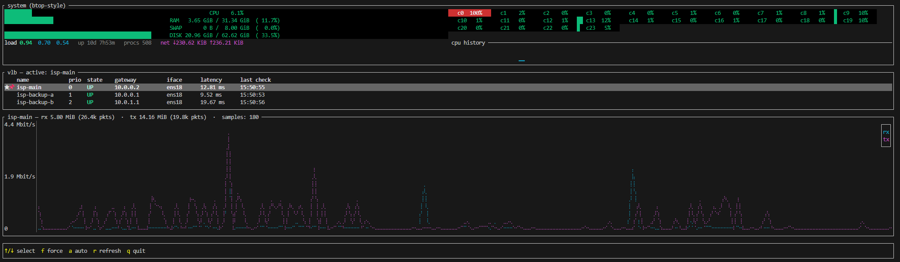

# vlb — Virtual Load Balancer

<p align="center">
  
</p>

<!--
  Once the repo is public, swap the two badges below for the live ones:
  [](https://github.com/DenisHumen/vlb-Virtual-Load-Balancer/actions/workflows/ci.yml)
  [](https://github.com/DenisHumen/vlb-Virtual-Load-Balancer/actions/workflows/release.yml)
-->
[](https://github.com/DenisHumen/vlb-Virtual-Load-Balancer/releases)
[](#runtime-requirements)
[](LICENSE)
[](https://www.rust-lang.org)

Multi-uplink failover gateway for Linux. Turns one box into an active/standby
router across several upstream ISPs: probes every provider independently,
installs the highest-priority healthy one as the kernel default route,
flushes conntrack on switch, and ships a TUI / control protocol / SQLite
stats so you can actually see what's happening.

> **Status:** `0.2.1`. Runs in production, and the failover behaviour is
> covered by a docker lab that breaks the network eight different ways on
> every CI run. Still pre-1.0: config keys can change between minor versions,
> and `vlb check` will tell you when they do.

---

## Why

If you have two or more ISPs hooked up to one Linux box, the usual options
are:

* **Multi-WAN routers** — black box, often Lua/UI-only, hard to integrate.
* **Bash + cron + ping** — fine until the day a provider answers ICMP for
  `1.1.1.1` but black-holes everything else.
* **`mwan3` / `keepalived` / OSPF** — overkill for a "one gateway, two
  uplinks" home/office setup, and weak for the failure modes that actually
  bite (DNS-only outages, intermittent ICMP-prohibited, partial blocking).

`vlb` is the in-between: a single binary that probes properly, switches
fast, and gives you a real dashboard.

---

## What it actually does

* **Per-provider, fwmark-bound probes**, all independent of which provider
  currently owns the default route. Each provider gets its own routing
  table (`ip rule fwmark`) so we can verify any uplink any time.
* **Five layers of health checks** per provider:
  1. **Gateway**: ICMP to next-hop on the LAN.
  2. **Internet**: 3-packet ICMP burst (≥2 replies needed) to a list of
     external targets — IPs *and hostnames*. Hostnames are resolved
     through that provider's DNS, so the resolved IP is reachable via the
     same uplink.
  3. **DNS**: explicit UDP/53 round-trip to public resolvers, again
     fwmarked. Catches "ICMP works but DNS is blocked" outages.
  4. **DNS integrity**: a random name under `.invalid` — which RFC 6761
     guarantees can never exist — must come back NXDOMAIN. A resolver that
     invents an address for it is being intercepted.
  5. **Content canary**: fetch a resource whose bytes we already know, over
     that uplink, and compare. See below — this is the one that catches the
     failure mode the others cannot.
  6. **Throughput floor**: move 64 KiB and check the link is not merely
     reachable but actually fast enough to be worth anything.
* **Selectively-prohibited detection**: if any hostname target is
  configured, at least one of them must succeed — so a happy `1.1.1.1`
  reply can't mask an uplink that returns
  `Destination Net Prohibited` for everything else.
* **Interception detection (the content canary).** Reachability probes all
  share one blind spot, and it is the failure mode that hurts most: an ISP
  whose account has lapsed usually does *not* black-hole traffic — it
  intercepts it. DNS answers get rewritten to a payment portal and HTTP
  requests get answered with a billing page, while ICMP is left working. The
  next hop pings, `1.1.1.1` pings, `google.com` resolves and pings (to the
  portal, which answers), DNS returns a well-formed NOERROR. Every
  reachability check passes and the uplink looks perfectly healthy while
  nothing actually works. `vlb` closes that gap by fetching content it
  already knows the answer to: an interceptor can fake reachability for
  free, but it cannot produce bytes it does not have. Wrong content is
  treated as *proof* rather than a symptom, so it bypasses the failure
  threshold and switches on first observation.
* **Deterministic priority-based selection** with separate fail / recover
  thresholds (anti-flap).
* **Default route written as `metric 0 proto static`** so it cleanly
  replaces existing netplan / DHCP defaults instead of coexisting with
  them — failback to the primary actually works.
* **Conntrack flush on every switchover** so live flows reset
  immediately instead of black-holing until TCP timeout.
* **Force / auto control** via TCP control socket (and TUI hotkey `f`):
  pin a specific provider as long as you like; pin survives even when
  the pinned provider is briefly Down (we serve the best healthy one
  meanwhile and snap back when the pin recovers).
* **SQLite stats** (WAL, indexed) for health checks, traffic, host
  metrics, state changes and failover events. 72 h retention by default.
* **TUI dashboard** (ratatui) — provider table, sparklines, traffic and
  CPU/mem graphs, hotkeys for force / auto.
* **Dry-run** that validates and prints every system call without doing
  it. Use this before pointing it at production.
* **Hardened config validator** — rejects reserved tables (253/254/255),
  overlong interface names, fwmark of 0, timeouts >= interval, control
  ports listening on non-loopback, and a few dozen more footguns.

---

## Install (or update) on a server

One command. It downloads the release for your architecture, verifies it
against the published SHA-256, checks the new build accepts your existing
config *before* replacing anything, and restarts the service:

```bash
curl -fsSL https://raw.githubusercontent.com/DenisHumen/vlb-Virtual-Load-Balancer/main/scripts/install.sh | sudo bash
```

Safe to re-run: it is the update path as well as the install path. Your
`/etc/vlb/vlb.toml` is never overwritten. If the new build rejects your config,
or the service fails to come back, it rolls back to the previous binary and
tells you why.

It adopts whatever is already there. If a `vlb` systemd unit exists, the
installer reads its `ExecStart` and updates *that* binary with *that* config
— so a box running out of `/opt/vlb` with its config beside it is updated in
place, rather than having a second copy quietly installed at the default
paths while the running one stays stale.

On a machine with no existing config it installs the annotated example and
stops short of starting the service, so it cannot bring up a gateway pointed
at example addresses.

Once installed, the box can update itself:

```bash
sudo vlb update
```

…or from the dashboard (`sudo vlb tui`), press `u`.

<details>
<summary>Options</summary>

| Variable       | Effect                                          |
|----------------|-------------------------------------------------|
| `VLB_VERSION`  | Install a specific tag instead of the latest    |
| `VLB_PRE=1`    | Consider pre-releases                            |
| `VLB_NO_START=1` | Install the binary, leave the service alone    |
| `VLB_SKIP_PROBE=1` | Skip the pre-restart canary reachability check |
| `VLB_REPO`     | Pull from a fork                                 |

```bash
curl -fsSL .../install.sh | sudo VLB_VERSION=v0.1.0 bash
```
</details>

---

## Quick start (development host)

```bash
# 1. clone, build
git clone https://github.com/DenisHumen/vlb-Virtual-Load-Balancer.git
cd vlb-Virtual-Load-Balancer
./scripts/vlb.sh build         # bootstraps rustup if needed

# 2. copy and edit the config
cp examples/vlb.example.toml vlb.toml
$EDITOR vlb.toml

# 3. validate it
./scripts/vlb.sh check

# 4. dry-run the daemon (no system mutation)
sudo VLB_CONFIG=$PWD/vlb.toml ./scripts/vlb.sh run --dry-run   # Ctrl+C to stop

# 5. real run, daemonised
sudo VLB_CONFIG=$PWD/vlb.toml ./scripts/vlb.sh start
sudo VLB_CONFIG=$PWD/vlb.toml ./scripts/vlb.sh tui    # dashboard
sudo VLB_CONFIG=$PWD/vlb.toml ./scripts/vlb.sh logs   # tail logs
sudo VLB_CONFIG=$PWD/vlb.toml ./scripts/vlb.sh stop
```

The launcher is documented inline (`./scripts/vlb.sh help`).

---

## Production install (systemd)

```bash
sudo ./scripts/vlb.sh install-service
# → installs /usr/local/bin/vlb,
#   /etc/systemd/system/vlb.service,
#   /etc/vlb/vlb.toml (your current config),
#   enables and starts the unit.

# Operate via systemd
sudo systemctl status vlb
sudo journalctl -u vlb -f
sudo systemctl restart vlb

# Or talk to the running daemon directly
vlb --config /etc/vlb/vlb.toml status
vlb --config /etc/vlb/vlb.toml tui
vlb --config /etc/vlb/vlb.toml stats --hours 24
```

Uninstall with `sudo ./scripts/vlb.sh uninstall-service` (keeps
`/etc/vlb` and the stats DB intact).

---

## Docker / Docker Compose

The container needs `--network host` and `--cap-add NET_ADMIN` (the
daemon manages routes, ip rules, iptables and policy routing — none of
that works in a default container netns).

```bash
# Build and start (compose file lives in ./docker)
docker compose -f docker/docker-compose.yml up -d --build

# Tail
docker compose -f docker/docker-compose.yml logs -f

# TUI inside the container
docker compose -f docker/docker-compose.yml exec vlb \
    vlb --config /etc/vlb/vlb.toml tui

# Stop
docker compose -f docker/docker-compose.yml down
```

`docker/docker-compose.yml` mounts `./vlb.toml` read-only and persists the
stats DB under `./data/`. See [`docker/Dockerfile`](docker/Dockerfile) and
[`docker/docker-compose.yml`](docker/docker-compose.yml) for the full picture.

A pre-built image will be published to Docker Hub later; for now the
compose file builds locally.

---

## Configuration reference

Full annotated example: [`examples/vlb.example.toml`](examples/vlb.example.toml). Most
deployments only edit `[general]` and `[[providers]]`.

```toml
[general]
lan_interface   = "ens18"        # interface that fronts your LAN clients
gateway_address = "10.0.0.100"   # this box's own LAN IP

[health]
interval_secs       = 3
timeout_ms          = 1000
failure_threshold   = 2          # ticks down before declaring DOWN
success_threshold   = 2          # ticks up before declaring UP
probe_targets       = ["1.1.1.1", "8.8.8.8", "google.com"]
dns_check_enabled   = true
dns_resolvers       = ["1.1.1.1", "8.8.8.8"]
dns_check_name      = "cloudflare.com"

[routing]
table_base  = 200                # provider tables: 200, 201, ...
fwmark_base = 0x200              # provider marks:  0x200, 0x201, ...
rule_pref   = 32000              # ip rule preference

[firewall]
manage                 = true    # write iptables MASQUERADE / mangle rules
disable_host_firewall  = false   # leave UFW etc. alone

[database]
path = "/var/lib/vlb/stats.db"

[canary]                         # content authenticity — see below
enabled         = true
interval_secs   = 10
timeout_ms      = 4000
quorum          = "majority"     # any | majority | all
failure_threshold = 2

[[canary.targets]]
url = "http://connectivitycheck.gstatic.com/generate_204"
expect_status = 204

[[canary.targets]]
url = "https://raw.githubusercontent.com/DenisHumen/vlb-Virtual-Load-Balancer/main/canary/canary.txt"
expect_contains = "vlb-canary-v1-do-not-edit"

[failover]
failback_stable_secs     = 30    # primary must be clean this long before we return
flap_threshold           = 3     # switches inside flap_window before backoff kicks in
flap_window_secs         = 600
max_failback_stable_secs = 900
route_watchdog_secs      = 15    # re-assert our default route if something else took it

[control]
listen = "127.0.0.1:7650"        # control socket; loopback only

[traffic]
enabled         = true
interval_secs   = 2
retention_hours = 72

[system]
enabled         = true
interval_secs   = 2
retention_hours = 72
per_core        = true

[[providers]]
name      = "isp-main"
gateway   = "10.0.0.2"
interface = "ens18"
priority  = 0                    # lower wins
role      = "primary"

[[providers]]
name      = "isp-backup"
gateway   = "10.0.0.1"
interface = "ens18"
priority  = 2                    # gaps are fine — see below
role      = "backup"
```

### Priorities

Lowest number wins. Priorities only have to be **unique** — they do not need
to start at 0 and gaps are allowed. `0` and `2` with nothing at `1` is a
perfectly good configuration, and leaving a gap is useful: you can slot in a
third uplink later without renumbering, which would otherwise move an
existing provider's routing table and fwmark (`table = table_base + priority`,
`mark = fwmark_base + priority`).

### Canary targets

Each target names a URL, the status code you expect, and optionally what the
body must look like. Set **exactly one** of:

| Field             | Meaning                                                        |
|-------------------|----------------------------------------------------------------|
| `expect_contains` | Body must contain this marker. Robust to line-ending changes.   |
| `expect_exact`    | Body must equal this string byte for byte.                      |
| `expect_sha256`   | SHA-256 of the body, 64 hex chars. Strictest.                   |
| *(none)*          | Only the status code is checked — for `generate_204`-style endpoints. |

The shipped defaults deliberately mix schemes, so that no single failure can
both cause a false failover and hide a real one:

* the two **plain-HTTP** endpoints are the standard captive-portal probes
  (what Android and Firefox use). Plain HTTP is precisely what an
  intercepting ISP rewrites, so these trip first and loudest;
* the **HTTPS** endpoint additionally proves the certificate chain — a
  transparent proxy cannot present a valid certificate for
  `raw.githubusercontent.com`, so it fails the handshake rather than serving
  a portal page.

`quorum = "majority"` (the default) means one endpoint being unavailable is
tolerated, while an interceptor — which necessarily breaks all of them —
still trips the check. Two failure kinds are distinguished:

* **tampered** — proof that something is answering in place of the real
  server. Overrides the quorum entirely: one tampered target takes the
  provider down immediately, with no threshold.
* **unreachable** — something failed, but benign explanations exist. Counts
  as a single vote and must repeat `failure_threshold` times.

Where the line falls matters, because `tampered` is powerful enough for one
endpoint to fail every uplink over on its own. Only signals that cannot occur
on a healthy link qualify:

| Observation                                  | Verdict     |
|----------------------------------------------|-------------|
| 3xx redirect                                 | tampered    |
| 511 Network Authentication Required          | tampered    |
| 2xx, but not the expected one                | tampered    |
| Expected status, wrong body                  | tampered    |
| Public hostname resolving into RFC1918/CGNAT | tampered    |
| **4xx / 5xx**                                | unreachable |
| Timeout, refused, TLS handshake failure      | unreachable |

The 4xx/5xx row is deliberate. Interceptors serve payment pages, not 404s, so
a 4xx overwhelmingly means a wrong URL or a broken endpoint — and treating a
typo'd canary URL as proof would fail over every provider at once on a
perfectly healthy network.

> Disabling the canary (`enabled = false`) removes the **only** check capable
> of detecting a reachable-but-intercepted uplink. `vlb check` and the daemon
> both warn when it is off.

### Throughput floor — the case content checking cannot see

Verifying content proves the bytes are genuine. It says nothing about how
*fast* they arrived, and a provider suspending an account may simply cap the
rate rather than redirect or drop.

It is worse than "small transfers are fast enough". A rate limiter is a token
bucket, so a small transfer drains the burst allowance and completes at **full
line speed**. Measured against a 64 kbit/s policer in the test lab:

| Transfer over the same throttled link | Time    | Effective rate |
|---------------------------------------|---------|----------------|
| the 1.2 KB canary file                | 0.6 ms  | ~16 Mbit/s (!) |
| a 256 KB transfer                     | 12.3 s  | 60 kbit/s      |

So no latency budget on the small probe could ever fire. `vlb` moves 64 KiB
twice a minute instead — under a kilobyte per second on average — and fails
the provider if the measured rate is below `min_kbps`.

The default floor of 128 kbit/s is deliberately low: a suspension throttle is
64–128 kbit/s, while any working link clears it comfortably. Round-trip time
alone caps the *measured* figure (64 KiB over a 100 ms RTT reads as roughly
5 Mbit/s however fast the pipe is), so a high floor would fail healthy
providers over — validation refuses anything above 5000. Run `vlb probe` to
see what your links actually report before changing it.

The probe runs only when the reachability layers pass; there is nothing to
learn about the speed of a link that is already down, and firing a 64 KiB
transfer at one would just delay the failover.

### Failback policy

Leaving a broken uplink is immediate and unconditional — users are offline
now, so any healthy provider beats the one we are on. Coming *back* is the
opposite: nothing is broken, so `vlb` waits until the higher-priority
provider has passed **every** layer continuously for `failback_stable_secs`.
If a link proves unstable — more than `flap_threshold` switches inside
`flap_window_secs` — that wait doubles for each extra switch, capped at
`max_failback_stable_secs`, and decays on its own once the link settles.

### Probe target rules

* IPv4 literal (e.g. `1.1.1.1`) → ping it directly through the
  provider's mark.
* Anything else → treated as a hostname, resolved via that provider's
  DNS resolvers (also marked), then ping the resolved IP through the
  same mark.
* Mix both. If at least one hostname is configured, at least one
  hostname must pass — so `google.com` failing while `1.1.1.1` works
  still counts as a broken uplink.

---

## CLI

```
vlb run    [--config <path>] [--dry-run]    # foreground daemon
vlb check  [--config <path>]                # validate + summary
vlb status [--config <path>]                # query running daemon
vlb tui    [--config <path>]                # dashboard
vlb force  [--config <path>] <name>         # pin provider
vlb auto   [--config <path>]                # release pin
vlb stats  [--config <path>] [--hours N] [--recent N]
vlb system [--config <path>] [--recent N]
vlb diag   [--config <path>]                # interfaces, DB, ports
vlb probe  [--config <path>] [--provider <name>] [--repeat N]
vlb update [--config <path>] [--check] [--pre] [--yes] [--force]
```

### `vlb probe` — size your timeouts from measurements

Runs every health layer once against each provider and prints what each one
actually cost, without touching the routing table. Use it to pick
`canary.timeout_ms` instead of guessing, and to see *why* a provider is
considered unhealthy:

```bash
sudo vlb --config /etc/vlb/vlb.toml probe --repeat 5
```

It reports the slowest observed run per layer — the number a timeout has to
accommodate — and suggests a `canary.timeout_ms`. Under an intercepted
uplink it names the interception explicitly rather than reporting a vague
timeout.

### `vlb update` — install the newest release

```bash
sudo vlb --config /etc/vlb/vlb.toml update --check   # look, change nothing
sudo vlb --config /etc/vlb/vlb.toml update           # install, with a prompt
```

Downloads the release asset for this host's architecture from GitHub,
verifies it against the published SHA-256, proves the new binary runs
(`--version`) *before* replacing the old one, keeps the previous binary as
`vlb.bak`, and restarts the systemd unit. The same flow is on the TUI's `u`
key.

---

## TUI hotkeys



| Key     | Action                                    |
|---------|-------------------------------------------|
| `↑`/`↓` | Move selection                            |
| `f`     | Force the selected provider               |
| `a`     | Release force, return to auto             |
| `r`     | Force redraw                              |
| `u`     | Check for a new release and install it    |
| `q`     | Quit                                      |

---

## How it works (one paragraph)

For each provider we install one routing table (`ip route add default via
<gw> dev <if> table <N>`), one fwmark policy rule (`ip rule add fwmark
<M> lookup <N>`), and one MASQUERADE rule on egress. Health probes set
`SO_MARK` (DNS) or pass `-m <mark>` (ping), so they always exit through
the chosen provider regardless of the active default. The state machine
counts consecutive successes/failures, picks the lowest-priority healthy
provider as active, and writes the result via `ip route replace default
via <chosen> metric 0 proto static`. On every change we `conntrack -F`
so live flows reset and reconnect.

---

## Failure modes we cover

| Symptom                                              | Detected by                |
|------------------------------------------------------|----------------------------|
| ISP cable / next-hop dead                            | gateway probe              |
| Uplink up, packet loss to internet                   | ICMP burst (≥2 of 3)       |
| Selectively allowed: `1.1.1.1` OK, `google.com` fails | hostname probe is mandatory |
| ICMP works, UDP/53 blocked (unpaid account, portal)  | dedicated DNS probe        |
| Intermittent `Destination Net Prohibited` flapping   | 3-packet burst, errors don't count as `received` |
| Sysctl `ip_forward=0`                                 | startup check (when `firewall.manage = true`) |
| Stale conntrack after switch                          | `conntrack -F` on every change |
| Two coexisting default routes (DHCP + ours)           | `metric 0 proto static` replace |
| **Account unpaid: DNS hijacked to a portal**          | **DNS integrity probe (`.invalid` must be NXDOMAIN)** |
| **Account unpaid: HTTP answered by a billing page**   | **content canary (bytes compared, redirects rejected)** |
| **Transparent TLS proxy**                             | **canary certificate validation fails the handshake** |
| **Account unpaid: rate-limited to a trickle**         | **throughput floor (64 KiB probe; small probes fit inside the limiter's burst and are useless)** |
| **Hostname resolves into RFC1918 / CGNAT space**      | **canary rejects the answer before even connecting** |
| External tool replaces our default route (DHCP renew) | route watchdog re-installs it |
| A provider that keeps bouncing up and down            | failback stability window + flap backoff |

---

## Testing

```bash
# everything that runs without root or docker: fmt, clippy, unit tests,
# and a validation pass over the shipped example config
./scripts/vlb.sh test

# ...plus the full failover lab in docker (a few minutes)
./scripts/vlb.sh test --lab
```

Run this before pushing — it is the same set CI enforces.

### The failover lab

`docker/test/` builds a hermetic two-ISP network and breaks it on purpose:

```
   ┌──────────────── edge 10.77.0.0/24 ────────────────┐
   │  vlb 10.77.0.100    isp1 10.77.0.2   isp2 10.77.0.3│
   └───────────────────────────────────────────────────┘
                        │              │
   ┌────────────── transit 192.0.2.0/24 ───────────────┐
   │  isp1 192.0.2.2     isp2 192.0.2.3   origin 192.0.2.10
   └───────────────────────────────────────────────────┘
```

Both providers hang off the *same* vlb interface with different next hops —
the single-armed topology of the real deployment — with priorities 0 and 2 so
the priority-gap case is exercised on every run. The `origin` container plays
the real internet and is the only holder of the genuine canary content,
reachable exclusively through one of the two ISPs. The lab's default route is
deleted at startup, so vlb owns the only one: if it picks the wrong provider,
nothing reaches the origin at all.

Each ISP can be switched between failure modes at runtime:

| Mode          | What it simulates                                                    |
|---------------|----------------------------------------------------------------------|
| `good`        | everything works                                                     |
| `dead`        | the router is gone — even the next-hop ping fails                    |
| `blackhole`   | answers pings, forwards nothing (defeats naive gateway checks)       |
| `lossy`       | 60% packet loss                                                      |
| `throttled`   | **link up, everything reachable, capped at 64 kbit/s** — only the throughput floor can see it |

Beyond the per-provider fault modes, the suite also covers the operational
cases that break gateways in the field: competing default routes from
netplan/networkd, a missing `conntrack`, operator `force`/`auto` racing a
switchover, a daemon restart on a healthy gateway, and a soak that runs six
full failover/failback cycles and then checks the daemon has not grown.
62 assertions in 18 scenarios, all on Ubuntu 24.04.
| `dns-blocked` | ICMP fine, UDP/53 dropped                                            |
| `portal-http` | **transparent HTTP proxy with DNS left completely honest** — every layer except the content check passes, so only the canary can see it |
| `expired`     | **unpaid account: DNS hijacked to a portal, HTTP answered by a billing page, ICMP left working** |
| `mitm`        | as `expired`, plus TLS interception with a forged certificate        |

`expired` and `portal-http` are the two that matter. `expired` is the full
production symptom. `portal-http` is the stricter test: it leaves DNS entirely
honest — the resolver still returns NXDOMAIN for `.invalid`, so the integrity
probe is satisfied — meaning a failover there can *only* have come from
comparing bytes. It exists so the canary cannot quietly stop working while the
DNS check covers for it.

In both modes the portal sits on a *public-looking* address (TEST-NET-3), and
the simulated internet on another (TEST-NET-1), rather than on RFC1918 space.
That is deliberate: vlb short-circuits a hijack that resolves into private
address space, so a private portal would never reach the content comparison at
all. Public-looking addresses force the real path — resolve, connect, fetch,
compare bytes.

```bash
docker/test/run-tests.sh                 # all scenarios
docker/test/run-tests.sh expired         # just the one
docker/test/run-tests.sh --keep          # leave the lab up to poke at

# manual poking
docker compose -f docker/test/docker-compose.yml exec isp1 isp-mode expired
docker compose -f docker/test/docker-compose.yml logs -f vlb
```

Scenarios assert on the **kernel's** default route and on whether traffic
from a separate `client` container — a plain LAN host whose only route out is
the vlb box — reaches the origin. That is deliberately not the gateway's own
traffic: it also exercises forwarding, NAT and the conntrack state a failover
disturbs, and it is what the people behind the gateway actually experience.
Assertions never rest on what vlb believes — a daemon that
reports a healthy failover while traffic still black-holes fails the test.

> One gap worth naming: the lab exercises the canary over plain HTTP. Testing
> a *successful* HTTPS canary hermetically would need a custom CA in the trust
> store, and `vlb` deliberately trusts only the webpki roots. TLS failure
> paths are covered (the `mitm` mode's forged certificate must be rejected),
> and the TLS client config is unit-tested; a successful HTTPS fetch is
> covered by the real-world default targets.

---

## Building from source

```bash
cargo build --release
# binary at target/release/vlb

# tests (no system mutation)
cargo test --release

# lint clean
cargo clippy --release --all-targets -- -D warnings
```

MSRV is **1.88**. The launcher script (`scripts/vlb.sh`) bootstraps
`rustup` automatically on hosts without a recent toolchain.

---

## Runtime requirements

* Linux kernel with policy routing (`ip rule`, fwmark) — every kernel
  shipped this decade.
* `iproute2` (`ip` command) and `iputils` ping (must support `-m
  <mark>` and fractional `-W`).
* `iptables` NAT table — nftables hosts ship `iptables-nft`, which
  works.
* `conntrack` — **install it.** Nominally optional, but without it the
  per-failover flush silently does nothing: failover looks like it worked
  while every established connection stays pinned to the dead provider and
  hangs until it times out. **A stock Ubuntu 24.04 server does not have it**,
  so this is the default state on a fresh box, not an edge case. The
  installer puts it there; `vlb check` and the daemon both say so if it is
  missing.
* Root (`CAP_NET_ADMIN` plus write access to `/proc/sys`).

---

## Ubuntu 24.04

The primary deployment target, and the platform the test lab runs on. Three
things differ from older releases and all three are handled:

* **`iptables` is the nf_tables backend** (`iptables-nft`). The rules vlb
  writes — MASQUERADE, the `-C` idempotency check, the FORWARD policy — all
  behave identically on it. Verified, not assumed.
* **`conntrack` is not installed.** See above; the installer adds it, because
  its absence degrades failover silently rather than loudly.
* **netplan drives systemd-networkd**, and both write default routes. `ip
  route replace` keys on (destination, metric, **proto**), so a rival default
  at the same metric 0 with a different proto is a *separate* route to the
  kernel: the two coexist at equal cost and the kernel picks between them by
  insertion order. vlb removes such rivals when it installs its own route,
  and the watchdog removes any that appear later — verified against `proto`
  values of `dhcp`, `static`, `kernel`, `boot` and `ra` at both metric 0 and
  higher.

A `netplan apply` or a DHCP renewal that replaces our route outright is
reclaimed within one `route_watchdog_secs` period.

---

## Troubleshooting

**Port already in use on start.**  
Another `vlb` is alive (systemd unit, leftover daemon, etc). Stop it
with `sudo systemctl stop vlb` or `sudo pkill -x vlb` and try again.
The launcher refuses to fork a second daemon on top of an existing one
on purpose.

**`ip route replace … failed`.**  
Usually means another process owns a default at the same `(metric,
proto)` key. We write at `metric 0 proto static` exactly because that
deterministically replaces netplan/networkd defaults. If you still see
it: `ip route show default` should give you the conflicting line.

**Failback never happens after the primary recovers.**  
You probably saw this on a netplan/networkd box. Confirm with `ip route
show default` that the live default is `proto static`, not `proto boot`
or `proto dhcp`. The fix is already in `vlb` (we always write `proto
static`); if you've manually pinned `proto boot` somewhere, remove that.

**Everything looks healthy but nobody has internet — and the ISP bill is overdue.**  
This is interception, not an outage. Confirm it with:

```bash
sudo vlb --config /etc/vlb/vlb.toml probe --provider isp-main
```

A tampered verdict names what came back instead of the expected content —
usually a payment page. `vlb` should have failed over on its own within one
canary interval; if it did not, check that `[canary] enabled = true` and that
`vlb check` lists targets. Before the content canary existed this case passed
every probe and no failover happened, which is precisely the bug it was added
to fix.

**Probes pass but the internet is dead.**  
You're hitting selective prohibition. Add a hostname to
`probe_targets` (e.g. `"google.com"`) — IP-only probes can be deceived
by upstreams that allow popular DNS IPs but block everything else. If the
uplink is intercepted rather than filtered, see the entry above.

**The canary fails on a provider that is genuinely fine.**  
Usually one endpoint being unreachable from your region. `quorum = "majority"`
already tolerates one of three; find out which with `vlb probe`, then either
replace that target or relax to `quorum = "any"`. If the failure is a timeout,
raise `canary.timeout_ms` — `vlb probe --repeat 5` prints a suggested value.

**Failback to the primary is slower than expected.**  
By design: `failback_stable_secs` (30 s default) plus flap backoff. If the
primary has been bouncing, the wait doubles for each extra switch inside
`flap_window_secs`. `RUST_LOG=debug` logs the countdown on every tick.

**`ping: invalid argument: '0x200'`.**  
`iputils-ping`'s `-m` takes decimal. Inside the daemon we always pass
decimal; if you're running ping by hand for diagnostics, do
`-m $((0x200))`.

**`SO_MARK` setsockopt fails with EPERM.**  
You're not root or the binary lost `CAP_NET_ADMIN`. The systemd unit
runs as root. If you're running by hand, prefix with `sudo`.

**Stats DB locked.**  
`*.db-wal` next to `stats.db` plus a stale process. Make sure only one
`vlb` is running.

---

## Repo layout

```
.
├── Cargo.toml
├── README.md
├── LICENSE
├── rustfmt.toml
├── canary/
│   └── canary.txt            # content fetched by the canary probe — do not edit
├── docker/
│   ├── Dockerfile
│   ├── docker-compose.yml
│   └── test/                 # hermetic two-ISP failover lab (see Testing)
├── docs/
│   └── assets/               # logo, screenshots used by README
├── examples/
│   └── vlb.example.toml      # annotated reference config
├── scripts/
│   ├── vlb.sh                # unified launcher (build / start / tui / logs / install-service / …)
│   └── vlb.ps1               # Windows helper (limited; Linux only feature set)
├── systemd/
│   └── vlb.service
└── src/
    ├── main.rs               # CLI dispatch + module wiring
    ├── core/
    │   ├── balancer.rs       # probe orchestration, control-plane glue
    │   ├── config.rs         # TOML schema + validator
    │   ├── selection.rs      # pure failover decision function (no I/O — heavily tested)
    │   └── update.rs         # self-update from GitHub Releases
    ├── net/
    │   ├── canary.rs         # content-authenticity probe
    │   ├── health.rs         # ICMP / DNS probes (fwmark-bound)
    │   ├── http.rs           # minimal SO_MARK-bound HTTP/HTTPS client
    │   ├── router.rs         # writes to the kernel routing table
    │   ├── system.rs         # iptables / sysctl / ip rule / table bring-up
    │   └── traffic.rs        # /proc/net/dev sampling
    ├── obs/
    │   ├── logger.rs         # tracing setup
    │   ├── stats.rs          # SQLite schema, queries, retention
    │   └── sysmon.rs         # host metric sampling
    └── ui/
        ├── control.rs        # tiny line-delimited JSON control protocol
        └── tui.rs            # dashboard
```

---

## Contributing

PRs welcome. Please run `cargo fmt`, `cargo clippy --release --all-targets
-- -D warnings`, and `cargo test --release` before opening one.

---

## License

MIT — see [`LICENSE`](LICENSE).
