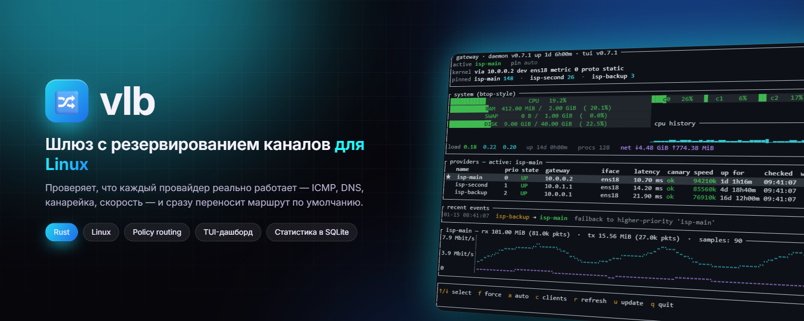
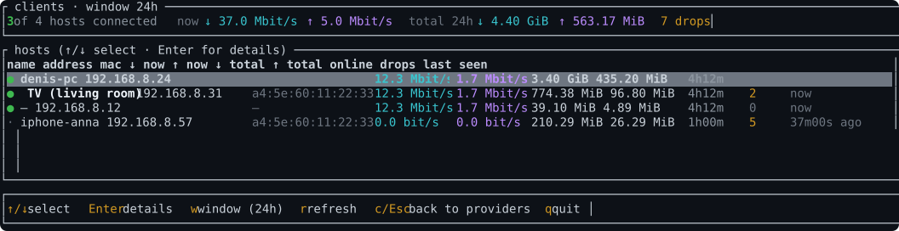
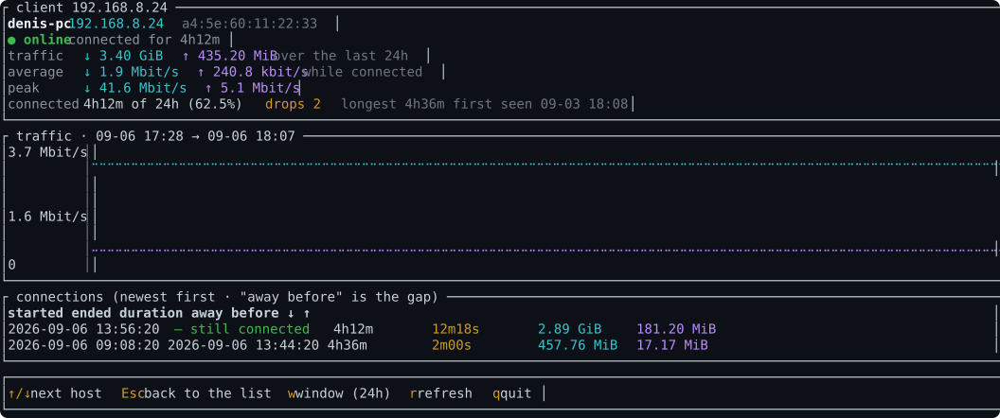
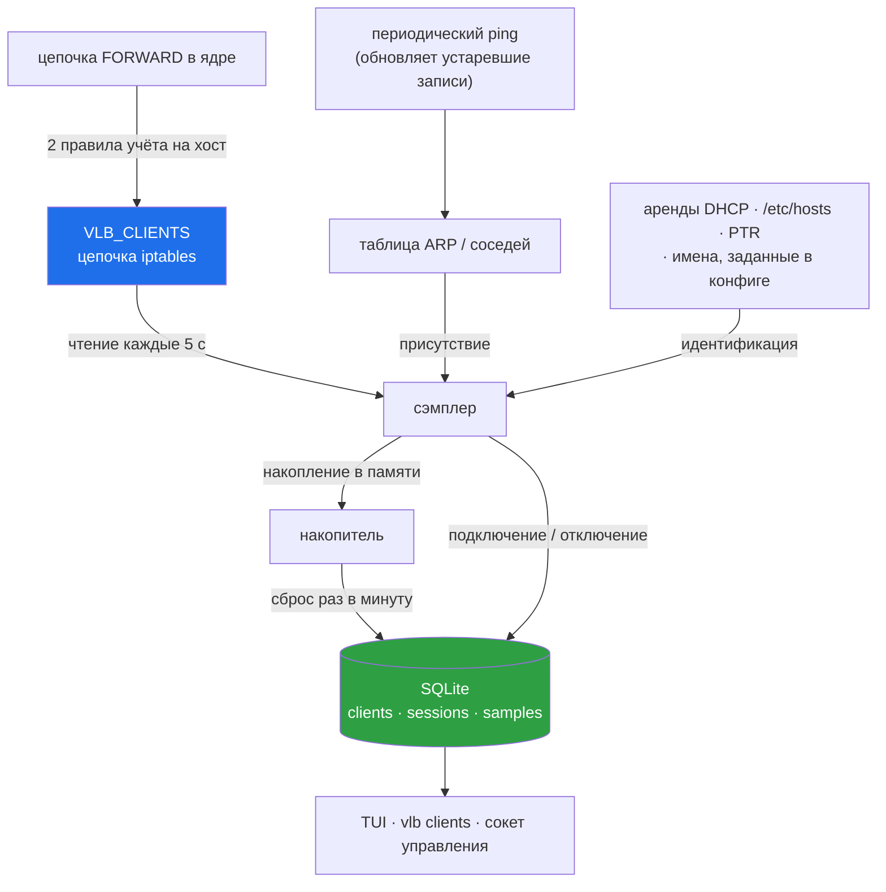
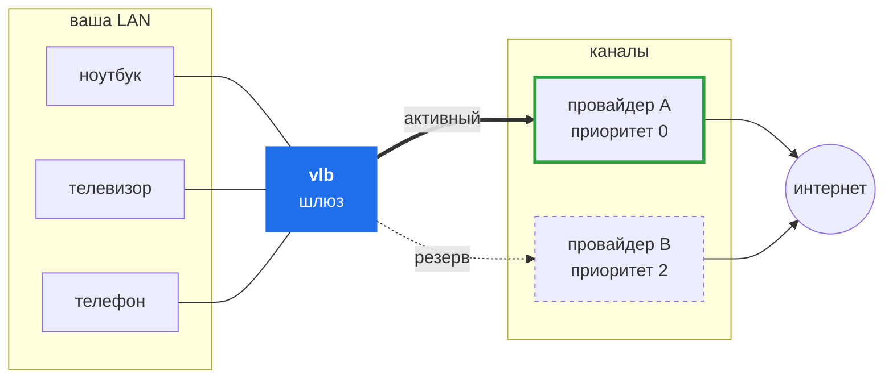
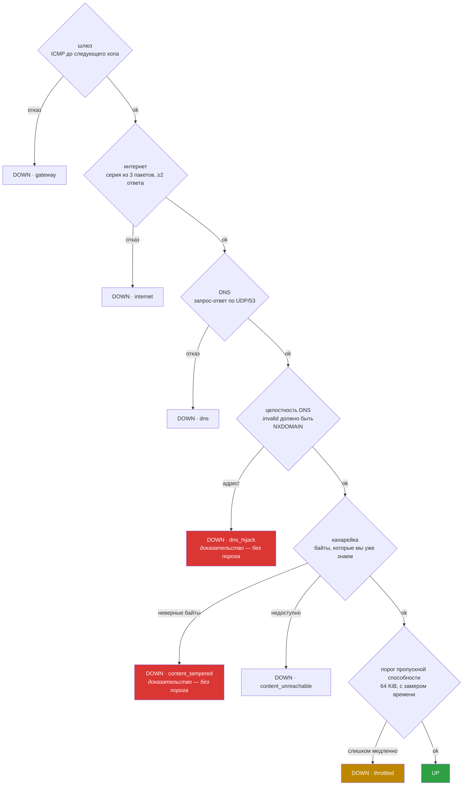
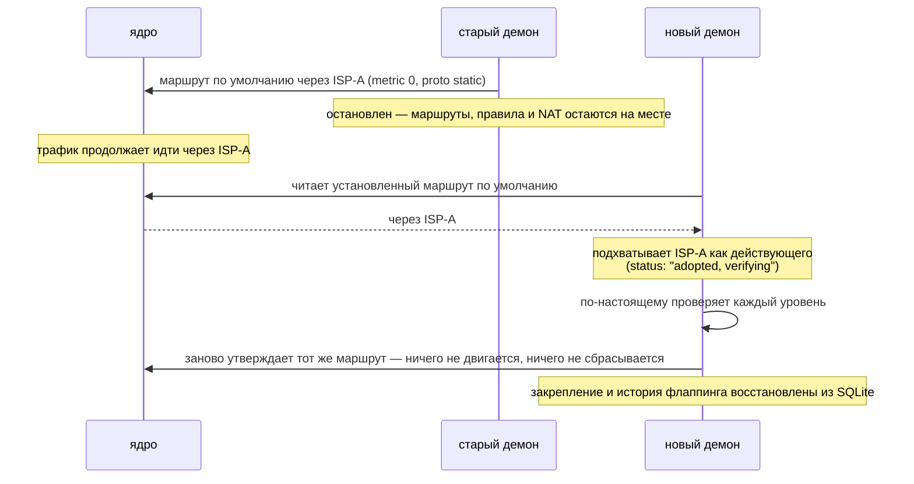

<div align="center">



# vlb — Virtual Load Balancer

**Шлюз с резервированием каналов для Linux: проверяет, что каждый провайдер действительно работает, а не просто отвечает на ping, — и переносит маршрут по умолчанию, как только один из них перестаёт работать.**

[](https://github.com/DenisHumen/vlb-Virtual-Load-Balancer/releases/latest)
[](https://github.com/DenisHumen/vlb-Virtual-Load-Balancer/actions/workflows/ci.yml)
[](https://www.rust-lang.org)
[](#-системные-требования)
[](#docker--docker-compose)
[](LICENSE)
[](https://github.com/DenisHumen/vlb-Virtual-Load-Balancer/commits/main)

[English](README.md) · **Русский**

[Возможности](#-возможности) · [Быстрый старт](#-быстрый-старт) · [Использование](#-использование) · [Конфигурация](#configuration) · [Решение проблем](#-решение-проблем)

</div>

---

`vlb` превращает один Linux-сервер в роутер active/standby поверх нескольких вышестоящих провайдеров. Он проверяет
каждого провайдера независимо, ставит в ядро маршрутом по умолчанию самого приоритетного из исправных, при
переключении сбрасывает conntrack, а в комплекте идут TUI-дашборд, протокол управления и локальная статистика
в SQLite — так что видно, что на самом деле происходит, вплоть до того, кого в LAN это задело. Это один бинарник
для домашней или офисной схемы «один шлюз, два канала или больше».

> **Статус:** `0.7.1`. Работает в продакшене, а поведение при переключении покрыто лабораторным стендом в Docker,
> который на каждом прогоне CI ломает сеть девятью разными способами — и ещё тремя способами перезапускает под ней
> демон. Версия пока до 1.0: ключи конфига могут меняться между минорными версиями, и `vlb check` сообщит, когда
> это произойдёт.

<p align="center">
  
</p>

<p align="center"><sub>
  Настоящее переключение, кадр за кадром: основной канал пойман на том, что отдаёт чужие байты, трафик уходит на
  следующий канал, основной восстанавливается, и маршрут возвращается только после того, как канал доказал свою
  исправность. Каждый кадр отрисован тестами из тех же виджетов, которыми рисует сама программа.
</sub></p>

### Зачем

Если к одному Linux-серверу подключены два провайдера или больше, обычно выбирают из следующего:

* **Multi-WAN-роутеры** — чёрный ящик, часто настраивается только через Lua или веб-интерфейс, плохо
  интегрируется.
* **Bash + cron + ping** — работает до того дня, когда провайдер отвечает по ICMP на `1.1.1.1`, но молча
  отбрасывает всё остальное.
* **`mwan3` / `keepalived` / OSPF** — избыточно для домашней или офисной схемы «один шлюз, два канала» и слабо
  против тех отказов, которые бьют на практике (падает только DNS, периодические ICMP-prohibited, частичная
  блокировка).

`vlb` — золотая середина: один бинарник, который проверяет как следует, переключает быстро и даёт настоящий
дашборд.

## ✨ Возможности

| | |
|---|---|
| 🩺 **Шесть уровней проверок** | ICMP до шлюза → серия ICMP в интернет → DNS-запрос туда и обратно → целостность DNS → канарейка (контент-проверка) → порог пропускной способности. Каждая проверка привязана к fwmark, поэтому любой канал можно проверить в любой момент, независимо от того, какой из них сейчас держит маршрут по умолчанию. |
| 🕵️ **Обнаружение перехвата** | Канарейка скачивает байты, которые ей заранее известны. Если из-за неоплаченного аккаунта провайдер подменяет DNS на платёжный портал или отвечает на HTTP страницей оплаты, это обнаруживается — и считается *доказательством*: переключение происходит с первого же наблюдения. |
| 🐢 **Обнаружение шейпинга** | Замер передачи 64 KiB ловит провайдера, урезавшего неоплаченный аккаунт до 64–128 kbit/s, и при этом не ставит каналу в вину трафик ваших же пользователей. |
| 🔀 **Детерминированное переключение** | Выбор по приоритету с раздельными порогами отказа и восстановления, окном стабильности перед возвратом на основной канал и защитой от флаппинга. Маршрут записывается как `metric 0 proto static`, конкурирующие маршруты по умолчанию удаляются, а watchdog следит, чтобы он оставался на месте. |
| 🔌 **Работа с соединениями** | При переключении conntrack сбрасывается, поэтому потоки обрываются, а не уходят в чёрную дыру. Опциональное закрепление соединений оставляет потоки на всё ещё работающих каналах и сбрасывает только соединения упавшего канала. |
| ♻️ **Перезапуски без простоя** | При остановке ничего не разбирается; следующий экземпляр подхватывает установленный маршрут и заново его проверяет. Закрепление оператора и история флаппинга переживают перезапуск, а опоздавший или отсутствующий при загрузке интерфейс не мешает демону работать. |
| 👥 **Статистика по клиентам** | Каждый хост за шлюзом — по адресу, MAC и имени: трафик, время подключения, обрывы и паузы между ними. Считает ядро, хранится локально, никуда не отправляется. |
| 📊 **TUI-дашборд и статистика в SQLite** | Дашборд на ratatui с таблицей провайдеров, спарклайнами, графиками трафика и CPU/памяти, последними переключениями и экранами клиентов. Статистика хранится в SQLite (WAL, индексы) с ограничением срока хранения и автоматическим сжатием. |
| 🎛 **Управление оператором** | Закрепить провайдера — `force`, снять закрепление — `auto`, через TCP-сокет управления, доступный только на loopback, или горячей клавишей в TUI; `vlb status` отдаёт JSON для скриптов. |
| 🛡 **Безопасность по умолчанию** | Режим dry-run, строгий валидатор конфига, мастер настройки, проверяющий каждое изменение, и самообновление с проверкой контрольной суммы и автоматическим откатом. |

<details>
<summary><b>Всё, что он умеет, подробно</b></summary>

* **Проверки для каждого провайдера с привязкой к fwmark**, никак не зависящие от того, какому провайдеру сейчас
  принадлежит маршрут по умолчанию. У каждого провайдера своя таблица маршрутизации (`ip rule fwmark`), поэтому
  любой канал можно проверить в любой момент.
* **Шесть уровней проверок** для каждого провайдера:
  1. **Шлюз**: ICMP до следующего хопа в LAN.
  2. **Интернет**: серия из 3 ICMP-пакетов (нужно ≥2 ответа) к списку внешних целей — IP-адресов *и имён
     хостов*. Имена резолвятся через DNS этого же провайдера, так что полученный IP достижим через тот же канал.
  3. **DNS**: явный запрос-ответ по UDP/53 к публичным резолверам, тоже с fwmark. Ловит отказы вида «ICMP
     работает, а DNS заблокирован».
  4. **Целостность DNS**: случайное имя в зоне `.invalid` — которое, согласно RFC 6761, гарантированно не может
     существовать — должно вернуть NXDOMAIN. Если резолвер выдумывает для него адрес, его перехватывают.
  5. **Канарейка (контент-проверка)**: скачать через этот канал ресурс, байты которого нам заранее известны, и
     сравнить. Именно эта проверка ловит тот вид отказа, который не видят остальные (см. ниже).
  6. **Порог пропускной способности**: передать 64 KiB и убедиться, что канал не просто доступен, но и достаточно
     быстр, чтобы от него был толк.
* **Обнаружение избирательных запретов**: если настроена хотя бы одна цель в виде имени хоста, хотя бы одна из
  таких целей должна пройти — так бодрый ответ от `1.1.1.1` не замаскирует канал, который на всё остальное
  отвечает `Destination Net Prohibited`.
* **Обнаружение перехвата (канарейка).** У всех проверок доступности одно общее слепое пятно, и приходится оно
  на самый болезненный вид отказа: провайдер, у которого закончилась оплата, обычно *не* отбрасывает трафик — он
  его перехватывает. Ответы DNS подменяются на платёжный портал, на HTTP-запросы отвечает страница оплаты, а ICMP
  продолжает работать. Следующий хоп пингуется, `1.1.1.1` пингуется, `google.com` резолвится и пингуется (в
  портал, который отвечает), DNS возвращает корректный NOERROR. Все проверки доступности проходят, и канал
  выглядит абсолютно здоровым, хотя на деле ничего не работает. `vlb` закрывает эту дыру, скачивая контент,
  правильный ответ для которого ему уже известен: перехватчик может бесплатно изобразить доступность, но не может
  выдать байты, которых у него нет. Неверный контент считается *доказательством*, а не симптомом, поэтому он
  минует порог отказов и приводит к переключению с первого же наблюдения.
* **Детерминированный выбор по приоритету** с раздельными порогами отказа и восстановления (защита от
  флаппинга).
* **Маршрут по умолчанию пишется как `metric 0 proto static`**, поэтому он чисто вытесняет существующие маршруты
  по умолчанию от netplan / DHCP, а не сосуществует с ними — и возврат на основной канал действительно работает.
* **Сброс conntrack при каждом переключении**, чтобы живые потоки сразу обрывались, а не уходили в чёрную дыру
  до истечения TCP-таймаута.
* **Перезапуски и обновления не прерывают трафик.** При остановке ничего не разбирается, и следующий экземпляр
  *подхватывает* найденный маршрут по умолчанию, а не выбирает заново: текущий провайдер продолжает нести трафик,
  пока новый процесс не вынесет о нём собственный вердикт по своим проверкам. Никакой смены маршрута, никакого
  сброса conntrack, никакого тридцатисекундного крюка через резервный канал только потому, что его проверки
  случайно закончились раньше. Закрепление оператора и история флаппинга тоже переживают перезапуск. При холодном
  старте — после перезагрузки, когда подхватывать нечего, — демон выжидает те несколько раундов, которые нужны
  более приоритетному провайдеру для вердикта, вместо того чтобы поставить первого же исправного и через мгновение
  переключиться снова.
* **Стартует, даже если интерфейса канала ещё нет.** Провайдер, чья сетевая карта при загрузке появляется с
  опозданием (или пропала), помечается как недоступный и перепроверяется каждый интервал проверок; остальные
  обслуживаются как обычно.
* **Управление force / auto** через TCP-сокет управления (и горячую клавишу `f` в TUI): закрепите нужного
  провайдера на сколько угодно. Закрепление сохраняется, даже когда закреплённый провайдер ненадолго падает (в это
  время трафик обслуживает лучший из исправных, а как только закреплённый восстановится, маршрут сразу вернётся
  на него).
* **Статистика по клиентам.** Каждый хост за шлюзом — по адресу, MAC и имени: сколько передал, сколько времени
  подключён и сколько раз у него обрывалось соединение — [с отдельным экраном](#-статистика-клиентов). Считает
  ядро, хранится локально в той же базе SQLite и никуда не отправляется.
* **Статистика в SQLite** (WAL, индексы): проверки состояния, трафик, метрики хоста, смены состояний, события
  переключения и клиенты. Всё остаётся на сервере.
* **TUI-дашборд** (ratatui) — таблица провайдеров, спарклайны, графики трафика и CPU/памяти, статистика клиентов,
  горячие клавиши для force / auto.
* **Dry-run**, который валидирует конфиг и печатает каждый системный вызов, не выполняя его. Прогоните его,
  прежде чем выпускать `vlb` в продакшен.
* **Строгий валидатор конфига** — отклоняет зарезервированные таблицы (253/254/255), слишком длинные имена
  интерфейсов, fwmark, равный 0, таймауты ≥ интервала, порты управления, слушающие не на loopback, и ещё
  несколько десятков способов выстрелить себе в ногу.
* **Мастер настройки**, который ставит зависимости, находит интерфейс, спрашивает про каждый канал и проверяет
  результат, — а на уже работающей машине открывает меню для изменения каналов, перезапуска и диагностики.
  [Посмотреть](#мастер-настройки-и-меню).

</details>

## 📸 Скриншоты

<table>
  <tr>
    <td colspan="2"><p align="center"><b>Дашборд</b> — панель шлюза, состояние провайдеров по уровням, последние переключения, трафик</p></td>
  </tr>
  <tr>
    <td width="50%"><p align="center"><b>Клиенты</b> — кто сейчас в сети</p></td>
    <td width="50%"><p align="center"><b>Один клиент</b> — каждое подключение и каждая пауза</p></td>
  </tr>
</table>

> Каждый скриншот дашборда в этом файле (пять терминальных SVG в `docs/assets/`) отрисован тестами из настоящих
> виджетов, и это проверяется, а не просто заявляется: обычный `cargo test` пересобирает все пять и падает, если закоммиченная версия отличается хотя бы
> на байт. Кроме того, он читает каждую картинку обратно и построчно сравнивает её с терминальным буфером, из
> которого она получена. Пересоздать их можно командой `VLB_SHOTS=1 cargo test --bin vlb tui::tests::render_readme_assets`.

## 🚀 Быстрый старт

Нужен Linux-сервер с root, policy routing и обычными сетевыми утилитами (`ip`, `ping`, `iptables`,
`conntrack`) — всё недостающее доставят мастер настройки и установщик. Подробности — в разделе
[Системные требования](#-системные-требования).

**Мастер настройки из клона репозитория** — рекомендуемый путь:

```bash
git clone https://github.com/DenisHumen/vlb-Virtual-Load-Balancer.git
cd vlb-Virtual-Load-Balancer
sudo bash scripts/vlb.sh install
```

Последняя команда доставит недостающее, определит, какой интерфейс смотрит в вашу сеть, спросит адрес шлюза для
каждого канала, запишет конфигурацию, запустит сервис и дождётся, пока трафик действительно не пойдёт через
проверенный канал. Запустите её позже ещё раз — и вместо этого откроется меню: добавить канал, изменить,
перезапустить, продиагностировать. [Подробнее ниже](#мастер-настройки-и-меню).

**Готовый бинарник из релиза, без сборки** — статические сборки для x86_64 и aarch64:

```bash
curl -fsSL https://raw.githubusercontent.com/DenisHumen/vlb-Virtual-Load-Balancer/main/scripts/install.sh | sudo bash
```

На чистой машине это установит пример конфига с комментариями и **не** запустит сервис. Отредактируйте его,
затем:

```bash
sudo $EDITOR /etc/vlb/vlb.toml
sudo vlb --config /etc/vlb/vlb.toml check
sudo vlb --config /etc/vlb/vlb.toml probe      # замеряет время каждого уровня проверок
sudo systemctl enable --now vlb
```

**Docker** — нужны сеть хоста (host networking) и `NET_ADMIN`:

```bash
cp examples/vlb.example.toml vlb.toml && $EDITOR vlb.toml
docker compose -f docker/docker-compose.yml up -d --build
```

Затем откройте дашборд командой `sudo vlb tui` — или `sudo bash scripts/vlb.sh tui` из клона репозитория; про
Docker см. [Docker / Docker Compose](#docker--docker-compose).

## 🧭 Использование

### Повседневные команды

Всё ниже предполагает, что конфиг лежит в `/etc/vlb/vlb.toml`: именно туда его кладёт мастер настройки, именно
его `vlb` использует по умолчанию, если файл существует, и именно его автоматически подхватывает `scripts/vlb.sh`.

| Хочу… | Команда |
|---|---|
| Установить или перенастроить | `sudo bash scripts/vlb.sh install` |
| Посмотреть, что происходит | `sudo vlb tui` |
| Проверить состояние из скрипта | `sudo vlb status` |
| Узнать, кто в сети | `sudo vlb clients` |
| Посмотреть историю одного хоста | `sudo vlb clients --ip 192.168.8.24` |
| Выяснить, почему канал лежит | `sudo vlb probe --provider isp-main` |
| Вручную закрепить канал | `sudo vlb force isp-backup` … `sudo vlb auto` |
| Перезапустить, не обрывая трафик | `sudo systemctl restart vlb` |
| Обновить | `sudo vlb update` (установка из релиза) — или `sudo bash scripts/vlb.sh update` (клон git) |
| Читать логи | `sudo journalctl -u vlb -f` |

### CLI

<details>
<summary><b>Полный справочник команд</b></summary>

```
vlb run    [--config <path>] [--dry-run]    # демон на переднем плане
vlb check  [--config <path>]                # валидация + сводка
vlb status [--config <path>]                # опрос работающего демона
vlb tui    [--config <path>]                # дашборд
vlb force  [--config <path>] <name>         # закрепить провайдера
vlb auto   [--config <path>]                # снять закрепление
vlb stats  [--config <path>] [--hours N] [--recent N]
vlb system [--config <path>] [--recent N]
vlb diag   [--config <path>]                # интерфейсы, БД, порты
vlb probe  [--config <path>] [--provider <name>] [--repeat N]
vlb clients [--config <path>] [--ip <addr>] [--hours N] [--json]
vlb update [--config <path>] [--check] [--pre] [--yes] [--force] [--skip-probe]
```

`--config` по умолчанию указывает на `/etc/vlb/vlb.toml`, если этот файл существует, а иначе — на `vlb.toml`
в текущем каталоге.

`vlb status` выдаёт JSON и предназначен для скриптов. Помимо таблицы по провайдерам в нём есть `active`,
`forced` (закрепление), `active_adopted` (маршрут подхвачен при старте, и новый процесс ещё не подтвердил своего
провайдера), `kernel_route` (что на самом деле стоит в ядре), `failback_pending` (обратный отсчёт, если он идёт),
`version` и `started_at`.

</details>

#### `vlb probe` — подбор таймаутов по реальным замерам

Прогоняет каждый уровень проверок по одному разу для каждого провайдера и печатает, сколько на самом деле занял
каждый из них, не трогая таблицу маршрутизации. Используйте его, чтобы подобрать `canary.timeout_ms`, а не
гадать, и чтобы увидеть, *почему* провайдер считается неисправным:

```bash
sudo vlb --config /etc/vlb/vlb.toml probe --repeat 5
```

Команда показывает самый медленный наблюдавшийся прогон на каждом уровне — именно его и должен вмещать
таймаут — и предлагает значение `canary.timeout_ms`. Если канал перехвачен, она прямо называет перехват, а не
сообщает о невнятном таймауте.

#### `vlb update` — установка свежего релиза

```bash
sudo vlb --config /etc/vlb/vlb.toml update --check   # посмотреть, ничего не меняя
sudo vlb --config /etc/vlb/vlb.toml update           # установить, с подтверждением
```

По порядку — и ничего на сервере не меняется, пока не пройден шаг 4:

1. скачивает артефакт релиза под архитектуру этого хоста и сверяет его с опубликованным SHA-256;
2. убеждается, что новый бинарник здесь запускается (`--version`);
3. запускает `check` нового бинарника на используемом конфиге — релиз, в котором ужесточили валидацию, будет
   пойман, пока рабочий бинарник ещё на месте, а не после перезапуска с лежащим шлюзом;
4. запускает `probe` нового бинарника и отказывается продолжать, если кворум канарейки не набирается ни через
   одного провайдера, поскольку перезапуск в таком состоянии выключил бы автоматическое переключение
   (`--skip-probe` это переопределяет);
5. атомарно подменяет бинарник, сохраняя предыдущий как `vlb.bak`;
6. перезапускает юнит и ждёт, пока демон ответит на сокете управления. Если сервис падает, предыдущий бинарник
   возвращается на место и перезапускается.

Сам перезапуск не трогает таблицу маршрутизации: новый демон подхватывает маршрут, оставленный старым, и заново
проверяет своего провайдера, прежде чем что-либо переключать. Тот же сценарий доступен в TUI по клавише `u`,
с отображением прогресса во время выполнения.

### Горячие клавиши TUI

| Клавиша | Действие                                        |
|---------|-------------------------------------------------|
| `↑`/`↓` | Перемещение по списку                           |
| `f`     | Закрепить выбранного провайдера                 |
| `a`     | Снять закрепление, вернуться в auto             |
| `c`     | **Статистика клиентов** — кто в LAN             |
| `r`     | Принудительная перерисовка                      |
| `u`     | Проверить, есть ли новый релиз, и установить его |
| `q`     | Выход                                           |

На экранах клиентов:

| Клавиша | Действие                                        |
|---------|-------------------------------------------------|
| `↑`/`↓` | Переход между хостами                           |
| `Enter` | Открыть полную историю хоста                    |
| `w`     | Переключить окно: 1h → 24h → 7d → 30d           |
| `Esc`   | Назад (подробности → список → дашборд)          |

Сверху вниз дашборд показывает: панель **шлюза** (активный провайдер и то, подтверждён ли он или пока только
подхвачен из таблицы маршрутизации, закрепление, обратный отсчёт до возврата на основной канал, собственный
маршрут по умолчанию из ядра, версия демона и аптайм), метрики хоста, таблицу **провайдеров** (состояние,
задержка, канарейка, пропускная способность, сколько времени каждый в строю и *почему* какой-то лежит),
**последние события** — каждое переключение с отметкой времени и причиной — и график трафика выбранного
провайдера. TUI продолжает работать во время перезапуска демона и сообщает, когда демон вернулся. Кроме того,
он прямо говорит, если он новее демона, с которым общается, вместо того чтобы показывать пустой экран.

## 🔀 Поведение при переключении

### Насколько охотно он переключается

Переключение не бесплатно: оно сбрасывает все соединения в сети. Поэтому планка — «этот канал перестал
работать», а не «у этого канала только что выдалась неудачная секунда».

Каждый уровень ведёт собственный счёт, потому что потерянный UDP-запрос и поддельная страница оплаты — улики
разного рода:

| уровень | по умолчанию | что это значит |
|---|---|---|
| доступность | 4 раунда, ~12s | следующий хоп или интернет не отвечали всё это время |
| DNS | 4 раунда, ~12s | UDP/53 теряет пакеты даже на идеальных каналах; один потерянный запрос — повод повторить попытку |
| канарейка | 3 раунда, ~30s | одна неудачная загрузка — это просто одна неудачная загрузка |
| порог пропускной способности | 3 замера | см. ниже |

Исключение — неверные байты. Поддельная страница оплаты или перехваченный резолвер — это доказательство, а не
симптом, поэтому реакция следует с первого же наблюдения.

**Порог пропускной способности не ставит вам в вину ваших же пользователей.** Он нужен, чтобы ловить провайдера,
урезавшего неоплаченный аккаунт до 64 kbit/s. Но на шлюзе он ловил бы и тот трафик, который вы сами через него
гоните: проверка на 64 KiB, пущенная по загруженному каналу, возвращается медленной безо всякой чьей-либо вины.
Если ничего с этим не делать, получается петля: канал признаётся задушенным, всех уводят с него, канал затихает,
следующий замер быстрый, все возвращаются обратно — и шлюз переключается каждые несколько минут, пока им хоть
кто-то пользуется. `vlb` снимает показания интерфейса до и после проверки и не засчитывает медленный замер
каналу, который в тот момент заведомо нёс больше порогового значения.

Весь набор удобнее менять через меню, а не вручную:

```bash
sudo bash scripts/vlb.sh install     # → пункт 9) How readily it switches
```

Quick — это примерно шесть секунд, Balanced (значение по умолчанию) — двенадцать, Patient — тридцать.

### Что переживает переключение

Честный ответ — потому что от него зависит, чего можно ждать от этого сервера.

**Соединение, чей провайдер продолжает работать, выживает.** При `routing.pin_connections = true` каждое
транзитное соединение на первом пакете помечается меткой того канала, который был активен в тот момент, и дальше
маршрутизируется по этой метке, а не по текущему маршруту по умолчанию. Поэтому переключения, которые означают
*хорошие новости*, — основной канал восстановился и маршрут вернулся на него, оператор вручную закрепил
провайдера, watchdog вернул маршрут после `netplan apply` — не трогают ничего из уже работающего. За новым
маршрутом идут только новые соединения.

Это бо́льшая часть переключений, которые совершает исправный шлюз, и до версии 0.6.0 каждое из них сбрасывало
все соединения на сервере.

**Соединение, чей провайдер действительно умер, не выживает — и не может выжить.** Каждый ваш канал — это роутер,
который прячет этот шлюз за *своим* публичным адресом. Как только трафик уходит через другой канал, удалённая
сторона получает пакеты с адреса, с которым у неё нет соединения, и разрывает его. Ничто, установленное на этой
машине, не может этому помешать: адрес принадлежит роутеру провайдера в одном хопе отсюда, а отправка пакетов с
его адресом через другого провайдера — это подмена источника (source spoofing), и вышестоящая сеть такие пакеты
отбрасывает.

Вместо этого `vlb` делает потерю точечной и мгновенной. Когда провайдер падает, его соединения выселяются
**по метке**, так что они обрываются сразу, а не ждут пятидневного таймаута conntrack, — и ничьи другие
соединения не затрагиваются. Раньше единственный сбой на основном канале стоил вам двух сбросов всего подряд:
одного при уходе и одного при возвращении.

```bash
sudo bash scripts/vlb.sh install      # меню → 8) Connections during a switch
```

или вручную:

```toml
[routing]
pin_connections = true      # нужен установленный conntrack
```

По умолчанию выключено. Эта опция меняет маршрутизацию каждого транзитного пакета, так что включайте её
осознанно.

После этого можно увидеть, как она работает. В панели шлюза на дашборде появляется строка с числом соединений,
которые держит каждый канал, и после возврата на основной канал тот канал, с которого ушли, должен по-прежнему
нести соединения, начатые через него:

```text
active isp-second   pin auto
kernel via 10.0.1.1 dev ens18 metric 0 proto static
pinned isp-main 148  ·  isp-second 26  ·  isp-backup 3
```

Те же числа есть в `sudo vlb status` в поле `pinned_connections`.

Предполагается, что ПО, которое нельзя прерывать, работает на машине *за* шлюзом, как обычно и бывает:
закрепляется только транзитный трафик. Соединения, которые открывает сам шлюз, не закрепляются — намеренно:
пометка таких соединений — верный способ отрезать самому себе доступ к собственному серверу.

<details>
<summary>Если нужно, чтобы потоки переживали и смерть канала</summary>

Есть ровно одна схема, которая это обеспечивает, и это изменение топологии, а не настройка: дать трафику
публичный адрес, который не принадлежит ни одному из каналов.

Арендуйте небольшой сервер со статическим адресом и поднимите с шлюза один туннель WireGuard до него. Трафик LAN
уходит в туннель, так что удалённая сторона всегда видит адрес арендованного сервера; `vlb` переключает между
каналами только *внешние* пакеты туннеля, а WireGuard переезжает на новый путь по первому аутентифицированному
пакету с него, без смены ключей. Поток замирает примерно на время переключения и затем продолжается.

Цена вполне реальна: каждый байт дважды проходит через этот сервер, вы платите за его трафик, MTU нужно
ограничить по самому узкому из ваших каналов, иначе большие пакеты будут молча пропадать, а сам сервер
становится отдельной единой точкой отказа. Сегодня `vlb` этим за вас не управляет. Схема описана здесь, чтобы
компромисс был виден, а не потому, что она рекомендуется.

Другой хрестоматийный ответ — BGP с собственным адресным пространством, на который опираются устройства вроде
F5, — недоступен на каналах, которые выдают адрес за NAT в общей LAN.

</details>

## 👥 Статистика клиентов

Нажмите <kbd>c</kbd> на дашборде или выполните `vlb clients`. Каждый хост за шлюзом, подключённые — первыми,
а <kbd>Enter</kbd> открывает любой из них:

<p align="center">
  
  <br />
  <sub>Статичные кадры, которые удобнее разглядывать:
  <a href="docs/assets/tui-clients.svg">список</a> ·
  <a href="docs/assets/tui-client-detail.svg">один клиент</a></sub>
</p>

Экран подробностей — это то место, где находится ответ на вопрос «это у нас или у них»: каждое подключение,
сколько оно длилось и **сколько хост отсутствовал между подключениями**.

<details>
<summary>Те же два экрана текстом, если удобнее копировать</summary>

Это те же статичные кадры, что по ссылкам выше, в той ширине, в которой они отрисованы: список — 132x19, один
клиент — 132x26.

```text
┌ clients · window 24h ────────────────────────────────────────────────────────────────────────────────────────────────────────────┐
│5 of 7 hosts connected   now ↓ 53.9 Mbit/s  ↑ 6.2 Mbit/s   total 24h ↓ 5.69 GiB  ↑ 738.68 MiB   11 drops                          │
└──────────────────────────────────────────────────────────────────────────────────────────────────────────────────────────────────┘
┌ hosts (↑/↓ select · Enter for details) ──────────────────────────────────────────────────────────────────────────────────────────┐
│   name             address         mac               ↓ now       ↑ now       ↓ total    ↑ total    online     drops last seen    │
│●  denis-pc         192.168.8.24    a4:5e:60:11:2c:9e 23.6 Mbit/s 2.3 Mbit/s  3.40 GiB   497.37 MiB 4h12m      0     now          │
│●  TV (living room) 192.168.8.31    a4:5e:60:12:2c:97 12.4 Mbit/s 1.5 Mbit/s  774.38 MiB 96.80 MiB  3h28m      2     now          │
│●  —                192.168.8.12    —                 8.4 Mbit/s  1.1 Mbit/s  39.10 MiB  4.34 MiB   2h44m      0     now          │
│·  iphone-anna      192.168.8.57    a4:5e:60:14:2c:89 0.0 bit/s   0.0 bit/s   210.29 MiB 21.03 MiB  1h00m      5     37m00s ago   │
│●  nas              192.168.8.9     a4:5e:60:15:2c:82 5.1 Mbit/s  720.0 kbit/ 1.20 GiB   111.32 MiB 1h16m      0     now          │
│●  work-laptop      192.168.8.44    a4:5e:60:16:2c:7b 4.3 Mbit/s  614.4 kbit/ 91.93 MiB  7.66 MiB   32m00s     1     now          │
│·  printer          192.168.8.71    a4:5e:60:17:2c:74 0.0 bit/s   0.0 bit/s   2.00 MiB   157.75 KiB 1h00m      3     37m00s ago   │
│                                                                                                                                  │
│                                                                                                                                  │
└──────────────────────────────────────────────────────────────────────────────────────────────────────────────────────────────────┘
┌──────────────────────────────────────────────────────────────────────────────────────────────────────────────────────────────────┐
│↑/↓ select  Enter details  w window (24h)  r refresh  c/Esc back to providers  q quit                                             │
│traffic is counted in the kernel per host; "online" comes from the ARP table, refreshed by an occasional ping                     │
└──────────────────────────────────────────────────────────────────────────────────────────────────────────────────────────────────┘
```

```text
┌ client 192.168.8.24 ─────────────────────────────────────────────────────────────────────────────────────────────────────────────┐
│denis-pc   192.168.8.24   a4:5e:60:11:2c:9e                                                                                       │
│● online  connected for 4h12m                                                                                                     │
│traffic   ↓ 3.40 GiB   ↑ 497.37 MiB   over the last 24h                                                                           │
│average   ↓ 921.9 kbit/s   ↑ 131.7 kbit/s   while connected                                                                       │
│peak      ↓ 39.8 Mbit/s   ↑ 4.3 Mbit/s                                                                                            │
│connected 8h48m of 24h  (36.7%)   drops 2   longest 4h36m   first seen 01-12 09:41                                                │
└──────────────────────────────────────────────────────────────────────────────────────────────────────────────────────────────────┘
┌ traffic · 01-14 09:56 → 01-15 09:41 ─────────────────────────────────────────────────────────────────────────────────────────────┐
│45.7 Mbit/s│                                                                                                                   ⣀  │
│           │                                                                        ⢰⠢⠤⣀                ⡔⠊⠉⡆                 ⡠⠊ ⠑⢄│
│           │                                                                        ⡸   ⠉⠢⡀           ⡠⠊   ⢇ ⢰⠢⣀           ⢀⠔⠁    │
│22.9 Mbit/s│                                                                        ⡇     ⠈⢢        ⣀⠜     ⢸ ⡎  ⠱⡀      ⢀⠤⠒⠁      │
│           │                                                                        ⡇       ⠑⢄⡀ ⢀⠤⠒⠊       ⢸⢀⠇   ⠈⠢⡀  ⡠⠊⠁         │
│           │                                                                       ⢠⠃         ⠈⠑⠊          ⠘⣼      ⠑⠢⠜            │
│0          │⣀⣀⣀⣀⣀⣀⣀⣀⣀⣀⣀⣀⣀⣀⣀⣀⣀⣀⣀⣀⣀⣀⣀⣀⣀⣀⣀⣀⣀⣀⣀⣀⣀⣀⣀⣀⣀⣀⣀⣀⣀⣀⣀⣀⣀⣀⣀⣀⣀⣀⣀⣀⣀⣀⣀⣀⣀⣀⣀⣀⣀⣀⣀⣀⣀⣀⣀⣀⣀⣀⣀⣀⠔⠒⠒⠒⠒⠢⠤⠤⠤⠤⠤⠤⠤⠒⠒⠒⠒⠒⠒⠒⠊⠉⠉⠱⡠⠊⠉⠑⠒⠒⠒⠒⠒⠒⠒⠤⠤⠤⠤⠤⠤⠔⠒⠒⠒⠒│
└──────────────────────────────────────────────────────────────────────────────────────────────────────────────────────────────────┘
┌ connections (newest first · "away before" is the gap) ───────────────────────────────────────────────────────────────────────────┐
│started               ended                 duration    away before   ↓            ↑                                              │
│2026-01-15 05:29:07   — still connected     4h12m       12m18s        1.62 GiB     237.38 MiB                                     │
│2026-01-15 00:40:49   2026-01-15 05:16:49   4h36m       2m00s         1.78 GiB     259.99 MiB                                     │
└──────────────────────────────────────────────────────────────────────────────────────────────────────────────────────────────────┘
┌──────────────────────────────────────────────────────────────────────────────────────────────────────────────────────────────────┐
│↑/↓ next host  Esc back to the list  w window (24h)  r refresh  q quit                                                            │
│                                                                                                                                  │
└──────────────────────────────────────────────────────────────────────────────────────────────────────────────────────────────────┘
```

</details>

### То же самое из командной строки

```bash
sudo vlb clients                          # список
sudo vlb clients --hours 168              # неделя вместо суток
sudo vlb clients --ip 192.168.8.24        # полная история одного хоста
sudo vlb clients --json | jq '.clients[]' # для скриптов
```

### Откуда берутся числа



Три осознанных решения, стоящих за этой схемой:

* **Считает ядро.** Два правила на хост в нашей собственной цепочке — `-s <ip>` и `-d <ip>`, без цели `-j`, так
  что они считают и пропускают пакет дальше. Ничего не сэмплируется, ничего не оценивается приблизительно, и
  завершившийся поток не уносит свои байты с собой. NAT не мешает: маскарадинг происходит позже, в `POSTROUTING`,
  поэтому собственный адрес хоста виден в обоих направлениях.
* **Присутствие — по ARP, с подталкиванием.** Хост, молчавший полминуты, переходит в таблице соседей в состояние
  `STALE`, а это выглядит ровно так же, как ушедший хост. Поэтому устаревшим соседям время от времени отправляется
  ping — и даже хост, отбрасывающий ICMP, обязан ответить на предшествующий ему ARP-запрос, что и обновляет
  запись. Без этого каждый простаивающий ноутбук показывал бы отключение каждую минуту.
* **Снимать часто, писать редко.** Присутствие и скорости читаются каждые несколько секунд; трафик накапливается
  в памяти и записывается раз в минуту, и только если он ненулевой. Присутствие стоит две строки на подключение,
  а не по строке на каждый тик. Шлюзу, проработавшему год, не нужна база размером с его логи.

Об одном пробеле стоит знать: хост учитывается с момента, когда он *обнаружен*, поэтому машина, которую раньше
никто не видел, может передать трафик в пределах одного интервала опроса, прежде чем для неё появятся правила.
Это происходит один раз на хост — правила остаются на месте, когда клиент затихает, и переживают перезапуски
демона, так что вернувшийся ноутбук учитывается с первого же пакета. Альтернатива — заранее создавать правила
для каждого адреса в сегменте — прямой путь к бесконечно растущему набору правил в сети с гостевым Wi-Fi.

### Имена

В порядке приоритета — побеждает первый источник, который знает имя:

| Источник | Настройка |
|---|---|
| Ваша собственная метка | `[[clients.names]]` в конфиге, по MAC или IP |
| Аренда DHCP | автоматически, если на этом сервере работает dnsmasq / OpenWrt / Kea |
| `/etc/hosts` | автоматически |
| Обратный DNS | автоматически, через системный резолвер (`resolve_hostnames`) |

Машина, которой никто не может дать имя, отображается как `—` и всё равно учитывается; она идентифицируется по
адресу и MAC.

```toml
[[clients.names]]
name = "Denis PC"
mac  = "a4:5e:60:11:22:33"   # переживает смену аренды

[[clients.names]]
name = "NAS"
ip   = "192.168.8.9"
```

### Что *не* считается клиентом

Шлюзы провайдеров, собственные адреса этой машины, broadcast и multicast исключаются автоматически — роутер
провайдера в том же сегменте LAN не относится к вашим пользователям. Всё остальное, что вы не хотите учитывать
(управляемый коммутатор, точку доступа), добавьте в `clients.exclude`.

### Как отключить

Учёт клиентов устанавливает одну цепочку iptables. Если вы запретили `vlb` управлять файрволом
(`firewall.manage = false`), он ничего не устанавливает, пока вы явно об этом не попросите:

```toml
[clients]
enabled = false     # или true, чтобы вести учёт даже при firewall.manage = false
```

`vlb check` показывает, какой из двух вариантов у вас.

## 🛠 Установка и эксплуатация

### Мастер настройки и меню

```bash
sudo bash scripts/vlb.sh install
```

На машине без конфигурации мастер проходит весь путь — зависимости, интерфейс в сторону LAN, шлюз каждого канала
(проверяется ping прямо при вводе) — и завершает работу тем, что записывает `/etc/vlb/vlb.toml`, устанавливает
сервис и ждёт, пока не сможет сообщить **`carrying traffic through isp-main, verified by its own checks`**.

<details>
<summary>Как выглядит первый запуск</summary>

```text
Dependencies
────────────
[ ok] ip, ping, iptables and conntrack are all present

Which interface faces your LAN and the uplinks?
───────────────────────────────────────────────
  1) ens18      10.0.0.100/10
The default route currently leaves through: ens18
Interface [ens18]:

Uplinks
───────
Add them best first. The first one you enter is the primary; the others are
tried in the order you give them if it fails.

Uplink 1
  Name (no spaces) [isp-main]:
  Gateway (the ISP router's address): 10.0.0.2
[ ok]   10.0.0.2 answers ping
  Interface it is reached on [ens18]:
  Priority (lower wins) [0]:
  Role (primary/backup) [primary]:

Add a backup uplink? (strongly recommended — with one uplink there is
nothing to fail over to) (y/n) [y]:
```

</details>

Три вещи, которых он не делает, — и каждая выучена на горьком опыте:

* **Он никогда не оставляет конфигурацию, которую отверг бы демон.** Каждое изменение пишется во временный файл,
  валидируется настоящим бинарником и только после этого перемещается поверх рабочего — с сохранением предыдущей
  версии рядом. Шлюз, чей конфиг отвергнут, не поднимется.
* **Он никогда не оставляет в вашем клоне репозитория файлов, принадлежащих root.** Сборка под `sudo` делает
  `target/` недоступным для записи вашему обычному пользователю; поэтому сборка возвращается во владение тому,
  кому принадлежит дерево исходников, и уже принадлежащий root каталог `target/` тоже возвращается.
* **Он никогда не отвечает на собственные вопросы.** Если он запущен через pipe или без стандартного ввода, он
  останавливается и сообщает об этом, а не принимает по очереди все значения по умолчанию, настраивая шлюз, о
  котором никто не просил.

Запустите его повторно на настроенной машине — откроется меню:

```text
  config   /etc/vlb/vlb.toml
  daemon   running (systemd)
  active   isp-main

  1) Status
  2) Dashboard (TUI)
  3) Who is connected (clients)
  4) Uplinks — add, change, remove
  5) Restart
  6) Diagnose a problem
  7) Update from git
  0) Quit
```

Добавление канала задаёт те же четыре вопроса и проверяет ответ, прежде чем его принять: адрес, который не
подключён напрямую, не может быть следующим хопом, и мастер говорит об этом в момент ввода, а не оставляет вас
выяснять это позже по поведению демона. Пункт **Diagnose** запускает поуровневую проверку с замером времени,
печатает собственные маршруты и policy-правила ядра и показывает хвост лога.

### Установка (или обновление) на сервере

Одна команда. Она скачивает релиз под вашу архитектуру, сверяет его с опубликованным SHA-256, проверяет, что
новая сборка принимает ваш текущий конфиг, *до* того как что-либо заменить, и перезапускает сервис:

```bash
curl -fsSL https://raw.githubusercontent.com/DenisHumen/vlb-Virtual-Load-Balancer/main/scripts/install.sh | sudo bash
```

Запускать повторно безопасно: это одновременно путь и для обновления, и для установки. Ваш `/etc/vlb/vlb.toml`
никогда не перезаписывается. Если новая сборка отвергает ваш конфиг, не может достучаться до целей канарейки или
сервис не поднимается обратно, выполняется откат на предыдущий бинарник — и на предыдущий юнит — с объяснением
причины.

Перезапуск посередине не прерывает трафик. Старый демон оставляет свои маршруты на месте, а новый подхватывает
их и заново проверяет активного провайдера собственными проверками, прежде чем вообще рассматривать какие-либо
переключения. Установщик дожидается этой проверки и сообщает
`carrying traffic via: isp-main (verified by the new build)`.

Установщик подхватывает то, что уже установлено. Если существует systemd-юнит `vlb`, установщик читает его
`ExecStart` и обновляет *именно этот* бинарник с *именно этим* конфигом — так что сервер, на котором всё работает
из `/opt/vlb` с конфигом рядом, обновляется на месте, а не получает тихо установленную вторую копию по путям по
умолчанию, пока работающая остаётся устаревшей. Стандартный юнит-файл обновляется вместе с бинарником
(предыдущий сохраняется как `vlb.service.bak`); отредактированный вручную юнит остаётся нетронутым, о чём
выводится сообщение. Локальные изменения кладите в drop-in (`sudo systemctl edit vlb`) — тогда они переживут
любое обновление.

На машине без существующего конфига установщик ставит пример с комментариями и не запускает сервис, чтобы не
поднять шлюз, настроенный на адреса из примера.

После установки сервер может обновлять себя сам с точно такой же страховкой:

```bash
sudo vlb update
```

…или нажмите `u` на дашборде (`sudo vlb tui`). Оба способа запускают `check` новой сборки на вашем конфиге,
запускают её `probe`, чтобы убедиться в достижимости кворума канарейки, подменяют бинарник, перезапускают
сервис, ждут ответа демона и откатываются, если ответа нет.

<details>
<summary>Параметры установщика</summary>

| Переменная         | Действие                                                      |
|--------------------|---------------------------------------------------------------|
| `VLB_VERSION`      | Установить конкретный тег вместо последнего                   |
| `VLB_PRE=1`        | Учитывать пре-релизы                                          |
| `VLB_NO_START=1`   | Установить бинарник, не трогая сервис                         |
| `VLB_SKIP_PROBE=1` | Пропустить проверку достижимости канарейки перед перезапуском |
| `VLB_REPO`         | Скачивать из форка                                            |

```bash
curl -fsSL .../install.sh | sudo VLB_VERSION=v0.2.1 bash
```

</details>

### Обновление из клона git

Если вы запускаете `vlb` прямо из клона, а не из релиза, всё обновление — одна команда:

```bash
sudo bash scripts/vlb.sh update
```

Она делает pull, собирает, проверяет новый бинарник на **собственной конфигурации этой машины**, устанавливает
его туда, откуда его на самом деле запускает сервис, перезапускает и ждёт ответа. Если сервис не поднимается,
предыдущий бинарник возвращается на место, сервис перезапускается снова, а причина выводится из журнала. Каждый
предыдущий шаг сам по себе безопасен при сбое: конфликтующий pull, не компилирующаяся сборка или бинарник,
отвергающий ваш конфиг, — всё это останавливает процесс до развёртывания и откатывает клон к прежнему состоянию.

> **Если вы обновлялись через `git pull && vlb.sh restart`, это никогда ничего не развёртывало.** Сборка пишет
> `target/release/vlb`, а systemd-юнит запускает `/usr/local/bin/vlb`. Перезапуск между ними заново запускал
> старый бинарник и рапортовал об успехе, а последующий `start` гонялся с работающим демоном за порт управления.
> Исправлено в 0.6.0 — и именно поэтому возможности, которые вы подтягивали, могли так и не появиться.
> Используйте `update`.

Перезапуск не прерывает трафик (см. [Как это работает](#как-это-работает)): новый процесс подхватывает маршрут по
умолчанию, оставленный старым в ядре.

> **Установите сервис один раз.** `sudo bash scripts/vlb.sh start` запускает шлюз из клона с pid-файлом — это
> работает, но не переживает перезагрузку и зависит от того, что каталог останется на своём месте. Это
> исправляется одной командой, и `update` подскажет её, если обнаружит, что шлюз работает таким образом:
>
> ```bash
> sudo bash scripts/vlb.sh install-service
> ```

```bash
sudo bash scripts/vlb.sh status     # что сейчас запущено
sudo bash scripts/vlb.sh tui        # дашборд (при необходимости пересобирает и перезапускает)
sudo bash scripts/vlb.sh clients    # кто в сети
sudo bash scripts/vlb.sh install    # меню настройки: каналы, перезапуск, диагностика
VLB_NO_RESTART=1 bash scripts/vlb.sh build   # пересобрать, не трогая демон
```

`scripts/vlb.sh` использует `/etc/vlb/vlb.toml`, если этот файл существует, и переходит на идущий в комплекте
пример, только когда его нет. Именно то, что рабочая конфигурация хранится вне отслеживаемого файла примера, и
делает `git pull` безопасным: отредактируйте пример — и следующий pull либо откажется обновляться, либо
перезапишет настройки вашего шлюза. У лаунчера есть встроенная справка по каждой команде
(`./scripts/vlb.sh help`).

### Установка в продакшене (systemd)

```bash
sudo ./scripts/vlb.sh install-service
# → устанавливает /usr/local/bin/vlb,
#   /etc/systemd/system/vlb.service,
#   /etc/vlb/vlb.toml (ваш текущий конфиг),
#   включает и запускает юнит.

# Управление через systemd
sudo systemctl status vlb        # сводка в одну строку: активный провайдер, состояние каждого провайдера, закрепление
sudo journalctl -u vlb -f
sudo systemctl restart vlb       # трафик не прерывается; маршрут подхватывается, а не выбирается заново

# Или напрямую через работающий демон
vlb --config /etc/vlb/vlb.toml status
vlb --config /etc/vlb/vlb.toml tui
vlb --config /etc/vlb/vlb.toml stats --hours 24
```

Журнал отведён под события. Провайдер, который начал сбоить, получает одно предупреждение с причиной, сводку
каждые 15 минут, пока ситуация сохраняется (`isp-b still failing: … — 90 failed checks in the last 15m`), и
строку при смене состояния; подробности по каждой проверке — на уровне DEBUG (`RUST_LOG=debug`). Сообщение
"No healthy providers" пишется в лог при возникновении ситуации, каждые 15 минут, пока она длится, и с указанием
длительности, когда она заканчивается. Кадр состояния печатается, когда меняется состояние провайдера или
активный провайдер, а в остальное время — каждые `health.status_print_secs` (по умолчанию 15 минут; 0 = только
при изменениях).

<details>
<summary>Почему юнит-файл устроен именно так</summary>

Юнит написан для шлюза, и все решения в нём осознанные:

| Параметр                        | Зачем                                                               |
|---------------------------------|---------------------------------------------------------------------|
| `After=network.target`          | *не* `network-online.target`: тот ждёт все каналы, так что мёртвый провайдер при загрузке задержал бы демон переключения на срок до двух минут |
| `StartLimitIntervalSec=0`       | по умолчанию systemd сдаётся после пяти сбоев за десять секунд; на демоне шлюза крест не ставят никогда |
| `Restart=always`, `RestartSec=2`| за любым завершением — штатным или нет — следует перезапуск, а оставленные маршруты подхватываются |
| `Type=exec`                     | `systemctl start` завершается ошибкой, если бинарник не удаётся запустить, а не рапортует об успехе |
| `NotifyAccess=main`             | демон пишет свою строку состояния в `systemctl status` |
| `OOMScoreAdjust=-900`           | процесс, через который маршрутизируется весь объект, OOM killer должен выбирать последним |
| `ProtectSystem=full` + `ReadWritePaths=-/etc/sysctl.d` | харденинг с единственной записью, которая нужна демону: сохранением `ip_forward=1`, чтобы форвардинг был включён с самого начала загрузки |

</details>

Чтобы что-то изменить, используйте drop-in вместо правки файла — при обновлении установщик обновляет стандартный
юнит, а отредактированный не трогает:

```bash
sudo systemctl edit vlb      # например, [Service] Environment=RUST_LOG=debug
```

Удаление — `sudo ./scripts/vlb.sh uninstall-service` (`/etc/vlb` и БД статистики остаются нетронутыми).

### Docker / Docker Compose

Контейнеру нужны сеть хоста и `NET_ADMIN` (compose-файл также добавляет `NET_RAW`): демон управляет маршрутами,
ip rules, iptables и policy routing, и ничего из этого не работает в сетевом пространстве имён контейнера по
умолчанию.

```bash
# Compose-файл монтирует ./vlb.toml из корня репозитория — сначала создайте его
cp examples/vlb.example.toml vlb.toml
$EDITOR vlb.toml

# Сборка и запуск (compose-файл лежит в ./docker)
docker compose -f docker/docker-compose.yml up -d --build

# Логи в реальном времени
docker compose -f docker/docker-compose.yml logs -f

# TUI внутри контейнера
docker compose -f docker/docker-compose.yml exec vlb \
    vlb --config /etc/vlb/vlb.toml tui

# Остановка
docker compose -f docker/docker-compose.yml down
```

`docker/docker-compose.yml` монтирует `./vlb.toml` только для чтения и хранит БД статистики в `./data/`. Полная
картина — в [`docker/Dockerfile`](docker/Dockerfile) и [`docker/docker-compose.yml`](docker/docker-compose.yml).
Готовый образ будет опубликован на Docker Hub позже; пока compose-файл собирает образ локально.

### Машина для разработки

```bash
# 1. клонирование, сборка
git clone https://github.com/DenisHumen/vlb-Virtual-Load-Balancer.git
cd vlb-Virtual-Load-Balancer
./scripts/vlb.sh build         # при необходимости сам поставит rustup

# 2. скопируйте и отредактируйте конфиг
cp examples/vlb.example.toml vlb.toml
$EDITOR vlb.toml

# 3. проверьте его
./scripts/vlb.sh check

# 4. dry-run демона (система не изменяется)
sudo VLB_CONFIG=$PWD/vlb.toml ./scripts/vlb.sh run --dry-run   # Ctrl+C для остановки

# 5. настоящий запуск, в фоне
sudo VLB_CONFIG=$PWD/vlb.toml ./scripts/vlb.sh start
sudo VLB_CONFIG=$PWD/vlb.toml ./scripts/vlb.sh tui    # дашборд
sudo VLB_CONFIG=$PWD/vlb.toml ./scripts/vlb.sh logs   # логи в реальном времени
sudo VLB_CONFIG=$PWD/vlb.toml ./scripts/vlb.sh stop
```

### Сборка из исходников

```bash
cargo build --release
# бинарник — в target/release/vlb

# тесты (система не изменяется)
cargo test --release

# линтер без единого предупреждения
cargo clippy --release --all-targets -- -D warnings
```

MSRV — **1.88**. Скрипт-лаунчер (`scripts/vlb.sh`) сам ставит `rustup` на хостах, где нет достаточно свежего
тулчейна.

<a id="configuration"></a>

## ⚙️ Конфигурация

Полный пример с комментариями — [`examples/vlb.example.toml`](examples/vlb.example.toml); именно его установщик
кладёт на чистую машину. В большинстве развёртываний правят только `[general]` и `[[providers]]`.

| Секция | Что задаёт |
|---|---|
| `[general]` | интерфейс в сторону LAN и собственный LAN-адрес этого сервера |
| `[health]` | проверки доступности и DNS: интервал, таймауты, пороги, цели, резолверы |
| `[canary]`, `[[canary.targets]]` | подлинность контента: какие URL, что они должны вернуть, кворум |
| `[canary.throughput]` | порог пропускной способности: URL, минимальная скорость, интервал |
| `[failover]` | окно стабильности перед возвратом на основной канал, защита от флаппинга, watchdog маршрута |
| `[routing]` | таблицы и fwmark провайдеров, приоритет (preference) правил, закрепление соединений |
| `[firewall]` | пишет ли `vlb` правила iptables MASQUERADE / mangle |
| `[database]` | путь к SQLite и автоматическое сжатие |
| `[control]` | адрес сокета управления (только loopback) |
| `[traffic]`, `[system]` | сбор и срок хранения трафика интерфейсов и метрик хоста |
| `[clients]` | учёт по клиентам |
| `[update]` | где `vlb update` и клавиша `u` в TUI ищут релизы |
| `[[providers]]` | по блоку на канал: имя, шлюз, интерфейс, приоритет, роль |

<details>
<summary><b>Справочник по конфигурации</b> — все секции со значениями из примера</summary>

```toml
[general]
lan_interface   = "ens18"        # интерфейс, смотрящий на клиентов LAN
gateway_address = "10.0.0.100"   # собственный LAN-адрес этого сервера

[health]
interval_secs         = 3
timeout_ms            = 1000
failure_threshold     = 4        # раундов с отказом до признания DOWN (встроенное значение, если не задано: 2)
success_threshold     = 2        # успешных раундов до признания UP
dns_failure_threshold = 4        # у DNS свой, более высокий порог
status_print_secs     = 900      # кадр состояния в логе: при каждом изменении и с этой периодичностью (0 = только при изменениях)
probe_targets         = ["1.1.1.1", "8.8.8.8", "google.com"]
dns_check_enabled     = true
dns_resolvers         = ["1.1.1.1", "8.8.8.8"]
dns_check_name        = "cloudflare.com"
dns_integrity_check   = true     # случайное имя в .invalid должно вернуть NXDOMAIN
retention_hours       = 72       # таблица health_checks; 0 отключает очистку

[canary]                         # подлинность контента — см. ниже
enabled           = true
interval_secs     = 10
timeout_ms        = 4000
quorum            = "majority"   # any | majority | all
failure_threshold = 3            # встроенное значение, если не задано: 2

[[canary.targets]]
url = "http://connectivitycheck.gstatic.com/generate_204"
expect_status = 204

[[canary.targets]]
url = "http://detectportal.firefox.com/success.txt"
expect_exact = "success\n"

[[canary.targets]]
url = "https://raw.githubusercontent.com/DenisHumen/vlb-Virtual-Load-Balancer/main/canary/canary.txt"
expect_contains = "vlb-canary-v1-do-not-edit"

[canary.throughput]              # порог пропускной способности — см. ниже
enabled           = true
url               = "https://raw.githubusercontent.com/DenisHumen/vlb-Virtual-Load-Balancer/main/canary/throughput-64k.bin"
min_kbps          = 128
interval_secs     = 120
timeout_ms        = 15000
failure_threshold = 3            # встроенное значение, если не задано: 2

[failover]
failback_stable_secs     = 30    # столько основной канал должен быть чист, прежде чем мы на него вернёмся
flap_threshold           = 3     # переключений внутри flap_window до включения backoff
flap_window_secs         = 600
max_failback_stable_secs = 900
route_watchdog_secs      = 15    # восстановить наш маршрут по умолчанию, если его занял кто-то другой

[routing]
table_base  = 200                # таблицы провайдеров: 200, 201, ...
fwmark_base = 0x200              # метки провайдеров:  0x200, 0x201, ...
fwmark_mask = 0xffff             # какие биты метки принадлежат нам
rule_pref   = 32000              # preference для ip rule
pin_connections = false          # держать соединение на канале, через который оно началось

[firewall]
manage                 = true    # писать правила iptables MASQUERADE / mangle
disable_host_firewall  = false   # не трогать UFW и т. п.

[database]
path         = "/var/lib/vlb/stats.db"
auto_compact = true              # возвращать диску место, освобождённое очисткой

[control]
listen = "127.0.0.1:7650"        # сокет управления; только loopback

[traffic]
enabled         = true
interval_secs   = 2
retention_hours = 72

[system]
enabled         = true
interval_secs   = 2
retention_hours = 72
per_core        = true

[clients]                        # учёт по клиентам — см. «Статистика клиентов»
enabled            = true        # не задано: следует firewall.manage
interval_secs      = 5
persist_every_secs = 60
offline_after_secs = 180
retention_hours    = 168
presence_probe     = true
resolve_hostnames  = true
max_tracked        = 512

[update]                         # используется `vlb update` и клавишей `u` в TUI
repo             = "DenisHumen/vlb-Virtual-Load-Balancer"
allow_prerelease = false
restart_service  = true
service_name     = "vlb"

[[providers]]
name      = "isp-main"
gateway   = "10.0.0.2"
interface = "ens18"
priority  = 0                    # побеждает меньший
role      = "primary"

[[providers]]
name      = "isp-backup"
gateway   = "10.0.0.1"
interface = "ens18"
priority  = 2                    # пропуски допустимы — см. ниже
role      = "backup"
```

</details>

### Приоритеты

Побеждает наименьшее число. Приоритеты должны быть только **уникальными** — начинаться с 0 они не обязаны, и
пропуски допустимы. `0` и `2` без `1` — вполне нормальная конфигурация, а оставить пропуск даже полезно: позже
можно вставить третий канал без перенумерации, которая иначе сдвинула бы таблицу маршрутизации и fwmark
существующего провайдера (`table = table_base + priority`, `mark = fwmark_base + priority`).

### Цели канарейки

Каждая цель задаёт URL, ожидаемый код ответа и, опционально, каким должно быть тело ответа. Укажите **ровно
одно** из:

| Поле              | Значение                                                              |
|-------------------|-----------------------------------------------------------------------|
| `expect_contains` | Тело должно содержать этот маркер. Устойчиво к смене переводов строк. |
| `expect_exact`    | Тело должно побайтно совпадать с этой строкой.                        |
| `expect_sha256`   | SHA-256 тела, 64 hex-символа. Самый строгий вариант.                  |
| *(ничего)*        | Проверяется только код ответа — для эндпоинтов в духе `generate_204`. |

Значения по умолчанию намеренно смешивают схемы, чтобы ни один отдельный сбой не мог одновременно вызвать ложное
переключение и скрыть настоящее:

* два эндпоинта на **чистом HTTP** — стандартные проверки captive portal (их используют Android и Firefox).
  Чистый HTTP — ровно то, что переписывает перехватывающий провайдер, поэтому они срабатывают первыми и громче
  всех;
* эндпоинт на **HTTPS** дополнительно проверяет цепочку сертификатов — прозрачный прокси не может предъявить
  валидный сертификат для `raw.githubusercontent.com`, поэтому рукопожатие проваливается, а страница портала так
  и не отдаётся.

`quorum = "majority"` (по умолчанию) означает, что недоступность одного эндпоинта допускается, а перехватчик,
который неизбежно ломает их все, всё равно вызывает срабатывание проверки. Различаются два вида отказа:

* **tampered** (подмена) — доказательство того, что вместо настоящего сервера отвечает кто-то другой. Полностью
  перекрывает кворум: одна подменённая цель сразу же кладёт провайдера, без всякого порога.
* **unreachable** (недоступность) — что-то не сработало, но возможны безобидные объяснения. Засчитывается как
  один голос и должно повториться `failure_threshold` раз.

<details>
<summary>Что считается <i>tampered</i>, а что — <i>unreachable</i></summary>

Где проходит граница, важно, потому что вердикт `tampered` настолько силён, что один эндпоинт в одиночку может
вызвать переключение со всех каналов. Подходят только сигналы, которые не могут возникнуть на исправном канале:

| Наблюдение                                          | Вердикт     |
|-----------------------------------------------------|-------------|
| Редирект 3xx                                        | tampered    |
| 511 Network Authentication Required                 | tampered    |
| 2xx, но не ожидаемый                                | tampered    |
| Ожидаемый код ответа, неверное тело                 | tampered    |
| Публичное имя хоста резолвится в RFC1918/CGNAT      | tampered    |
| **4xx / 5xx**                                       | unreachable |
| Таймаут, отказ в соединении, сбой TLS-рукопожатия   | unreachable |

Строка про 4xx/5xx — намеренная. Перехватчики отдают страницы оплаты, а не 404, так что 4xx почти всегда
означает неверный URL или сломанный эндпоинт — и если считать опечатку в URL канарейки доказательством, то на
совершенно исправной сети произошло бы переключение со всех провайдеров сразу.

</details>

> Отключение канарейки (`enabled = false`) убирает **единственную** проверку, способную обнаружить доступный,
> но перехваченный канал. И `vlb check`, и демон предупреждают, когда она выключена.

### Порог пропускной способности — случай, которого не видит проверка контента

Проверка контента доказывает, что байты подлинные. Она ничего не говорит о том, насколько *быстро* они пришли,
а провайдер, приостанавливающий аккаунт, может просто урезать скорость, а не перенаправлять или отбрасывать
трафик.

Всё хуже, чем «маленькие передачи проходят достаточно быстро». Ограничитель скорости — это token bucket, поэтому
маленькая передача укладывается в допустимый всплеск (burst) и завершается на **полной скорости линии**. Замер
на полисере 64 kbit/s в тестовом стенде:

| Передача по одному и тому же урезанному каналу | Время   | Эффективная скорость |
|------------------------------------------------|---------|----------------------|
| файл канарейки на 1.2 KB                       | 0.6 ms  | ~16 Mbit/s (!)       |
| передача 256 KB                                | 12.3 s  | 60 kbit/s            |

Поэтому никакой бюджет задержки для маленькой проверки не сработал бы никогда. Вместо этого `vlb` раз в две
минуты (`interval_secs = 120`) передаёт через каждого провайдера 64 KiB — в среднем это намного меньше килобайта
в секунду — и признаёт провайдера неисправным, если измеренная скорость ниже `min_kbps`.

Порог по умолчанию в 128 kbit/s намеренно низкий: шейпинг при приостановке аккаунта — это 64–128 kbit/s, а любой
рабочий канал проходит порог с большим запасом. Одно лишь время кругового пути ограничивает *измеряемую*
величину (64 KiB при RTT 100 ms дают примерно 5 Mbit/s, как бы быстр ни был канал), так что высокий порог
приводил бы к переключению с исправных провайдеров — валидация отвергает всё, что выше 5000. Прежде чем менять
порог, запустите `vlb probe` и посмотрите, что на самом деле показывают ваши каналы.

Проверка запускается, только если прошли уровни доступности: нечего выяснять о скорости канала, который уже
лежит, а передача 64 KiB по нему лишь задержала бы переключение.

### Политика возврата на основной канал

Уход с неисправного канала — немедленный и безусловный: пользователи уже без связи, так что любой исправный
провайдер лучше текущего. *Возврат* — ровно наоборот: ничего не сломано, поэтому `vlb` ждёт, пока более
приоритетный провайдер будет непрерывно проходить **все** уровни в течение `failback_stable_secs`. Если канал
оказывается нестабильным — больше `flap_threshold` переключений за `flap_window_secs`, — это ожидание
удваивается за каждое лишнее переключение, но не больше `max_failback_stable_secs`, и само сокращается, когда
канал успокаивается.

### База статистики

Каждая таблица с `retention_hours` раз в час очищается ровно до этого окна. При `auto_compact = true` (по
умолчанию) место, которое занимали эти строки, тоже возвращается файловой системе: SQLite повторно использует
освободившиеся страницы, но сам никогда не уменьшает файл, так что без этого файл так и оставался бы размером с
максимум, которого он когда-либо достигал.

База, созданная релизом до 0.7.1, перезаписывается один раз, при первом запуске, если больше четверти её (и не
меньше 64 MiB) занимают пустые страницы. Для нескольких сотен мегабайт данных это занимает секунды;
маршрутизация этого не ждёт, ждут только первые проверки. Если на диске нет места под удвоенный объём живых
данных, этот шаг пропускается с предупреждением и командой для ручного запуска. Дальше небольшой шаг после
каждой очистки поддерживает файл компактным.

### Трафик по провайдерам

При `firewall.manage = true` транзитный трафик учитывается по каналам в собственной цепочке `vlb`, подключённой
к `FORWARD` (`VLB_UPLINKS`), с разбивкой по провайдеру, которому принадлежит каждое соединение: по его метке
закрепления, если закрепление соединений её поставило, а иначе — по провайдеру, который был активен (без
закрепления именно туда и уходил каждый транзитный пакет). Провайдеры на общем интерфейсе получают каждый свои
числа, и в сумме они дают итог.

Без управления файрволом делить не по чему. Провайдер с отдельным интерфейсом учитывается по этому интерфейсу;
провайдеры на общем интерфейсе показываются вместе как итог по этому интерфейсу — дашборд подписывает график
`ens18, all providers on it`, а `vlb stats` выводит его как `ens18 (all)`, — а не так, будто каждому из них
достался весь трафик.

### Учёт клиентов

Подробный разбор — в разделе [Статистика клиентов](#-статистика-клиентов). Параметры:

| Ключ | По умолчанию | Что меняет |
|---|---|---|
| `enabled` | следует `firewall.manage` | Устанавливается ли цепочка учёта вообще |
| `interval_secs` | `5` | Как часто читаются присутствие и счётчики |
| `persist_every_secs` | `60` | Как часто накопленный трафик пишется в SQLite |
| `offline_after_secs` | `180` | Сколько тишины должно пройти, чтобы хост считался отключённым; должно быть ≥ 3× интервала, иначе один пропущенный ответ ARP превратится в истории в «обрыв» |
| `retention_hours` | `168` | Сколько хранится история по хосту (список известных хостов не очищается никогда) |
| `presence_probe` | `true` | Пинговать устаревших соседей, чтобы простаивающий хост не считался ушедшим |
| `resolve_hostnames` | `true` | Определять имена обратным запросом через системный резолвер |
| `max_tracked` | `512` | Максимум хостов, для которых создаются правила учёта |
| `lease_files` | dnsmasq, OpenWrt, Kea | Откуда читать имена хостов из DHCP |
| `exclude` | — | Адреса, которые никогда не считаются клиентами |
| `[[clients.names]]` | — | Ваши собственные метки по `mac` или `ip` |

### Правила для целей проверки

* IPv4-литерал (например, `1.1.1.1`) → пингуется напрямую с меткой провайдера.
* Всё остальное → считается именем хоста, резолвится через DNS-резолверы этого провайдера (тоже с меткой), затем
  полученный IP пингуется с той же меткой.
* Можно сочетать оба варианта. Если задано хотя бы одно имя хоста, хотя бы одно имя должно пройти, — так что
  отказ `google.com` при работающем `1.1.1.1` всё равно считается неисправностью канала.

## 🧱 Архитектура



**Стек:** Rust (edition 2024, MSRV 1.88) · Tokio · ratatui + crossterm (TUI) · rusqlite со встроенным SQLite
· rustls с провайдером `ring` и корнями webpki (TLS для канарейки и самообновления) · clap · iproute2, iptables и
conntrack на хосте.

### Как это работает

Для каждого провайдера `vlb` создаёт одну таблицу маршрутизации (`ip route add default via <gw> dev <if> table <N>`),
одно policy-правило по fwmark (`ip rule add fwmark <M> lookup <N>`) и одно правило MASQUERADE на выходе. Проверки
состояния выставляют `SO_MARK` (DNS) или передают `-m <mark>` (ping), поэтому всегда выходят через выбранного
провайдера, независимо от активного маршрута по умолчанию. Конечный автомат считает подряд идущие
успехи/отказы, выбирает активным исправного провайдера с наименьшим значением приоритета и записывает результат
через `ip route replace default via <chosen> metric 0 proto static`. При каждом изменении он выполняет
`conntrack -F`, чтобы живые потоки сбросились и переподключились.

### Один раунд проверок для одного провайдера

Каждый уровень запускается, только если прошёл предыдущий: нечего выяснять DNS-запросом по выдернутому кабелю,
а передача 64 KiB по мёртвому каналу стоит целого таймаута и не даёт никакой информации.



Два красных блока — это *доказательства*, а не симптомы: ни один работающий канал не возвращает чужие байты,
поэтому они минуют порог отказов и приводят к переключению с первого же наблюдения. Всё остальное должно
повториться, прежде чем будет засчитано.

### Перезапуск или обновление

При остановке демона ничего не разбирается, а следующий продолжает с того места, где остановился предыдущий, а
не начинает с пустой таблицы:



Никакой смены маршрута, никакого сброса conntrack, никакого крюка через резервный канал только потому, что его
проверки случайно закончились раньше.

### Какие отказы мы покрываем

| Симптом                                                  | Чем обнаруживается         |
|----------------------------------------------------------|----------------------------|
| Кабель провайдера / следующий хоп мёртв                  | проверка шлюза             |
| Канал поднят, потери пакетов до интернета                | серия ICMP (≥2 из 3)       |
| Избирательный доступ: `1.1.1.1` OK, `google.com` не работает | проверка по имени хоста обязательна |
| ICMP работает, UDP/53 заблокирован (неоплаченный аккаунт, портал) | отдельная DNS-проверка |
| Периодически мигающий `Destination Net Prohibited`       | серия из 3 пакетов, ошибки не засчитываются как `received` |
| Sysctl `ip_forward=0`                                    | проверка при старте (при `firewall.manage = true`) |
| Устаревший conntrack после переключения                  | `conntrack -F` при каждом изменении |
| Два сосуществующих маршрута по умолчанию (DHCP + наш)    | `metric 0 proto static` плюс удаление любого конкурента с metric 0 — одно лишь `replace` ориентируется на proto и оставляет их на месте |
| **Аккаунт не оплачен: DNS перехвачен на портал**         | **проверка целостности DNS (`.invalid` должно давать NXDOMAIN)** |
| **Аккаунт не оплачен: на HTTP отвечает страница оплаты** | **канарейка (байты сравниваются, редиректы отвергаются)** |
| **Прозрачный TLS-прокси**                                | **проверка сертификата в канарейке проваливает рукопожатие** |
| **Аккаунт не оплачен: скорость урезана до минимума**     | **порог пропускной способности (проверка на 64 KiB; маленькие проверки укладываются в burst ограничителя и бесполезны)** |
| **Имя хоста резолвится в пространство RFC1918 / CGNAT**  | **канарейка отвергает ответ ещё до подключения** |
| Внешний инструмент заменяет наш маршрут по умолчанию (продление DHCP) | watchdog маршрута ставит его обратно |
| Провайдер, который постоянно то падает, то поднимается   | окно стабильности перед возвратом + защита от флаппинга |
| **Перезапуск / обновление демона при идущем трафике**    | **установленный маршрут подхватывается и сохраняется, пока по его провайдеру нет вердикта; без сброса, без крюка через резервный канал; закрепление и история флаппинга сохраняются** |
| **Интерфейс канала отсутствует при загрузке**            | **этот провайдер перепроверяется каждый интервал проверок; демон стартует и обслуживает остальные** |
| Watchdog срабатывает посреди переключения                | сериализован на той же блокировке, поэтому не может вернуть маршрут, с которого только что ушли |
| Цикл падений при загрузке                                | `StartLimitIntervalSec=0`, `Restart=always` — systemd никогда не ставит крест на шлюзе |
| **«Это интернет упал или только мой ноутбук?»**          | **сессии по клиентам: каждый обрыв — строка с началом, концом и паузой** |
| **«Кто съел весь канал в четыре часа?»**                 | **байтовые счётчики по клиентам в ядре, с историей по каждому хосту** |

## 🧪 Тестирование

```bash
# всё, что работает без root и docker: fmt, clippy, модульные тесты
# и проверка поставляемого примера конфига
./scripts/vlb.sh test

# ...плюс полный стенд фейловера в docker (несколько минут)
./scripts/vlb.sh test --lab
```

Запускайте это перед push — это тот же набор, который проверяет CI.

### Стенд фейловера

`docker/test/` строит герметичную сеть с двумя провайдерами и намеренно её ломает:

```
   ┌──────────────── edge 10.77.0.0/24 ────────────────┐
   │  vlb 10.77.0.100    isp1 10.77.0.2   isp2 10.77.0.3│
   └───────────────────────────────────────────────────┘
                        │              │
   ┌────────────── transit 192.0.2.0/24 ───────────────┐
   │  isp1 192.0.2.2     isp2 192.0.2.3   origin 192.0.2.10
   └───────────────────────────────────────────────────┘
```

Оба провайдера висят на *одном и том же* интерфейсе `vlb` с разными следующими хопами — одноплечевая топология,
как в реальном развёртывании, — с приоритетами 0 и 2, так что случай с пропуском в приоритетах проверяется при
каждом прогоне. Контейнер `origin` играет роль настоящего интернета и единственный хранит подлинный контент
канарейки, доступный исключительно через одного из двух провайдеров. Маршрут по умолчанию стенда удаляется при
старте, так что единственный маршрут принадлежит `vlb`: если он выберет не того провайдера, до origin не дойдёт
вообще ничего.

Каждого провайдера можно на лету переключать между режимами отказа:

| Режим         | Что имитирует                                                        |
|---------------|----------------------------------------------------------------------|
| `good`        | всё работает                                                         |
| `slow`        | всё работает, но на 60 ms дальше — исправный канал, проверки которого завершаются *позже*, чем у другого |
| `dead`        | роутера нет — не проходит даже ping следующего хопа                  |
| `blackhole`   | отвечает на ping, ничего не форвардит (обманывает наивные проверки шлюза) |
| `lossy`       | 60% потерь пакетов                                                   |
| `throttled`   | **канал поднят, всё доступно, скорость урезана до 64 kbit/s** — увидеть это может только порог пропускной способности |
| `dns-blocked` | ICMP в порядке, UDP/53 отбрасывается                                 |
| `portal-http` | **прозрачный HTTP-прокси при полностью честном DNS** — проходят все уровни, кроме проверки контента, так что увидеть это может только канарейка |
| `expired`     | **неоплаченный аккаунт: DNS перехвачен на портал, на HTTP отвечает страница оплаты, ICMP работает** |
| `mitm`        | как `expired`, плюс перехват TLS с поддельным сертификатом           |

```bash
docker/test/run-tests.sh                 # все сценарии
docker/test/run-tests.sh expired         # только один
docker/test/run-tests.sh --keep          # оставить стенд поднятым, чтобы в нём покопаться

# ручные эксперименты
docker compose -f docker/test/docker-compose.yml exec isp1 isp-mode expired
docker compose -f docker/test/docker-compose.yml logs -f vlb
```

103 ассерта в 26 сценариях, все — на Ubuntu 24.04.

<details>
<summary><b>Что стенд покрывает помимо режимов отказа</b></summary>

Помимо режимов отказа отдельных провайдеров, набор тестов покрывает и эксплуатационные случаи, на которых шлюзы
ломаются в реальной жизни: конкурирующие маршруты по умолчанию от netplan/networkd, отсутствующий `conntrack`,
гонку между командами оператора `force`/`auto` и переключением, длительный прогон (soak) из шести полных циклов
переключения и возврата с последующей проверкой, что демон не разросся, — и перезапуск, четырьмя способами.
Процесс демона убивается и перезапускается на месте (так делают обновление и `Restart=always`) на исправном
шлюзе, у которого основной канал *медленнее* резервного, в состоянии переключения на резервный канал и при
действующем закреплении оператора; контейнер перезапускается целиком — это случай перезагрузки; и стенд
поднимается с провайдером на несуществующем интерфейсе. В каждом случае маршрут не должен сдвинуться, в логе не
должно появиться ни одного переключения, закрепление должно вернуться, а трафик клиентов — продолжать идти.

Учёт клиентов проверяется на том же клиенте в LAN: через шлюз прогоняется настоящая передача на 256 KB, и набор
тестов проверяет, что байты приписаны этому хосту, что его MAC и имя определены, что шлюзы провайдеров в том же
сегменте *не* числятся пользователями, — а затем контейнер останавливается целиком, что является настоящим
отключением от LAN, и проверяется, что `vlb` это замечает, записывает обрыв и снова подхватывает хост с
нетронутой историей, когда тот возвращается.

Трафик по каналам проверяется на том же общем интерфейсе: скачанные клиентом 256 KB должны быть засчитаны
активному провайдеру, а резервный, через который ничего из этого не шло, не должен получить их тоже.

`expired` и `portal-http` — два самых важных режима. `expired` — полный симптом из продакшена. `portal-http` —
более строгий тест: DNS в нём полностью честный — резолвер по-прежнему возвращает NXDOMAIN для `.invalid`, так
что проверка целостности удовлетворена, — а значит, переключение там могло произойти *только* благодаря
сравнению байтов. Этот режим существует для того, чтобы канарейка не могла тихо перестать работать, пока её
прикрывает DNS-проверка.

В обоих режимах портал сидит на адресе, *похожем на публичный* (TEST-NET-3), а имитация интернета — на другом
таком же (TEST-NET-1), а не в пространстве RFC1918. Это сделано намеренно: `vlb` сразу отсекает перехват,
который резолвится в частное адресное пространство, так что портал на частном адресе вообще не дошёл бы до
сравнения контента. Адреса, похожие на публичные, заставляют пройти настоящий путь — резолв, подключение,
загрузка, сравнение байтов.

Сценарии проверяют маршрут по умолчанию **ядра** и то, доходит ли до origin трафик из отдельного контейнера
`client` — обычного хоста LAN, единственный путь наружу у которого лежит через сервер `vlb`. Это намеренно не
собственный трафик шлюза: так проверяются ещё и форвардинг, NAT и состояние conntrack, которое нарушает
переключение, — и именно это на самом деле ощущают люди за шлюзом. Ассерты никогда не опираются на то, что
думает `vlb`: демон, который рапортует об успешном переключении, пока трафик по-прежнему уходит в чёрную дыру,
тест проваливает.

> Один пробел стоит назвать прямо: стенд проверяет канарейку по чистому HTTP. Чтобы герметично протестировать
> *успешную* HTTPS-канарейку, понадобился бы собственный CA в хранилище доверенных сертификатов, а `vlb`
> намеренно доверяет только корням webpki. Пути отказа TLS покрыты (поддельный сертификат в режиме `mitm` должен
> быть отвергнут), а конфигурация TLS-клиента покрыта модульными тестами; успешная загрузка по HTTPS покрывается
> реальными целями по умолчанию.

</details>

## 🐧 Системные требования

* Ядро Linux с policy routing (`ip rule`, fwmark) — это любое ядро, выпущенное за последние десять лет.
* `iproute2` (команда `ip`) и ping из `iputils` (должен поддерживать `-m <mark>` и дробный `-W`).
* Таблица NAT в `iptables` — на хостах с nftables есть `iptables-nft`, с ним всё работает.
* `conntrack` — **установите его.** Формально он необязателен, но без него сброс при каждом переключении молча
  ничего не делает: переключение выглядит успешным, а все установленные соединения остаются привязанными к
  мёртвому провайдеру и висят до истечения таймаута. **На стандартном сервере Ubuntu 24.04 его нет**, так что это
  состояние по умолчанию на чистой машине, а не редкий крайний случай. Установщик его ставит; и `vlb check`, и
  демон сообщают, если его нет.
* Root (`CAP_NET_ADMIN` плюс право записи в `/proc/sys`).

`scripts/vlb.ps1` — ограниченный лаунчер для Windows (сборка, check, TUI, stats, стенд в Docker); сама работа с
форвардингом, iptables и ip rule возможна только в Linux.

### Ubuntu 24.04

Основная целевая платформа и платформа, на которой работает тестовый стенд. Ряд вещей в ней отличается от
старых релизов, и все они учтены:

* **`iptables` работает на бэкенде nf_tables** (`iptables-nft`). Правила, которые пишет `vlb`, — MASQUERADE,
  проверка идемпотентности через `-C`, политика FORWARD — ведут себя на нём идентично. Проверено, а не
  предположено.
* **`conntrack` не установлен.** См. выше; установщик его добавляет, потому что его отсутствие ухудшает
  переключение молча, а не громко.
* **netplan управляет systemd-networkd**, и оба пишут маршруты по умолчанию. `ip route replace` ориентируется на
  ключ (назначение, metric, **proto**), так что конкурирующий маршрут по умолчанию с той же metric 0, но другим
  proto для ядра — *отдельный* маршрут: они сосуществуют с равной стоимостью, и ядро выбирает между ними по
  порядку добавления. `vlb` удаляет таких конкурентов, когда ставит свой маршрут, а watchdog удаляет всех, кто
  появится позже, — проверено на значениях `proto` `dhcp`, `static`, `kernel`, `boot` и `ra` как при metric 0,
  так и при более высоких. `netplan apply` или продление DHCP, которые заменяют маршрут целиком, отыгрываются
  обратно в пределах одного периода `route_watchdog_secs`.
* **systemd 255.** Юнит опирается на `StartLimitIntervalSec=` в `[Unit]`, `Type=exec` и `ReadWritePaths=-…` —
  всё это существует уже много лет; `systemctl status vlb` показывает собственную строку состояния демона
  (активный провайдер, состояние каждого провайдера, закрепление) через `NotifyAccess=main`.

## 🩹 Решение проблем

<details>
<summary><b>Дашборд пишет "vlb has not answered yet".</b></summary>

Это нормально в течение нескольких секунд после запуска: демон поднимает policy routing и знакомится со всеми
хостами в LAN, а отвечает, когда всё уляжется. Дашборд сам повторяет попытки, а затем сообщает, какая из двух
вещей пошла не так: никто не слушает (демон не запущен) или слушает, но медленно. Если он сообщает о втором и
это не проходит, посмотрите `sudo journalctl -u vlb -n 50`.

</details>

<details>
<summary><b><code>vlb status</code> показывает <code>"active_adopted": true</code> / TUI пишет "adopted — verifying".</b></summary>

Это нормально в течение нескольких секунд после перезапуска: демон взял на себя маршрут, найденный в ядре, и
подтверждает этого провайдера собственными проверками (`success_threshold` раундов). Трафик всё это время идёт.
Если состояние не меняется, значит, подхваченный провайдер не проходит проверки, *и* при этом нет ни одного
другого исправного — запустите `vlb probe`.

</details>

<details>
<summary><b>При запуске порт уже занят.</b></summary>

Работает другой `vlb` (systemd-юнит, оставшийся демон и т. п.). Остановите его командой `sudo systemctl stop vlb`
или `sudo pkill -x vlb` и попробуйте снова. Лаунчер намеренно отказывается запускать второй демон поверх уже
существующего.

</details>

<details>
<summary><b><code>ip route replace … failed</code>.</b></summary>

Обычно это значит, что другой процесс владеет маршрутом по умолчанию с тем же ключом `(metric, proto)`. `vlb`
пишет с `metric 0 proto static` именно потому, что это детерминированно вытесняет маршруты по умолчанию от
netplan/networkd. Если ошибка всё равно появляется, `ip route show default` покажет конфликтующую строку.

</details>

<details>
<summary><b>Возврат на основной канал не происходит после его восстановления.</b></summary>

Скорее всего, вы столкнулись с этим на машине с netplan/networkd. Убедитесь через `ip route show default`, что
рабочий маршрут по умолчанию — `proto static`, а не `proto boot` или `proto dhcp`. Исправление уже есть в `vlb`
(он всегда пишет `proto static`); если вы где-то вручную прописали `proto boot`, уберите это.

</details>

<details>
<summary><b>Всё выглядит исправным, но интернета ни у кого нет — а счёт провайдера просрочен.</b></summary>

Это перехват, а не авария. Подтвердите так:

```bash
sudo vlb --config /etc/vlb/vlb.toml probe --provider isp-main
```

Вердикт tampered (подмена) называет, что пришло вместо ожидаемого контента, — обычно страница оплаты. `vlb`
должен был сам переключиться в пределах одного интервала канарейки; если этого не произошло, проверьте, что
`[canary] enabled = true` и что `vlb check` показывает цели. До появления канарейки этот случай проходил все
проверки и переключения не происходило — именно этот баг она и была призвана исправить.

</details>

<details>
<summary><b>Проверки проходят, но интернета нет.</b></summary>

Вы столкнулись с избирательным запретом. Добавьте имя хоста в `probe_targets` (например, `"google.com"`) —
проверки только по IP могут обмануть вышестоящие сети, которые пропускают популярные IP DNS-серверов, но
блокируют всё остальное. Если канал не фильтруется, а перехватывается, см. пункт выше.

</details>

<details>
<summary><b>Канарейка падает на провайдере, который на самом деле в порядке.</b></summary>

Обычно один из эндпоинтов недоступен из вашего региона. `quorum = "majority"` уже допускает отказ одного из
трёх; выясните, какого именно, с помощью `vlb probe`, а затем либо замените эту цель, либо ослабьте кворум до
`quorum = "any"`. Если отказ — это таймаут, увеличьте `canary.timeout_ms`: `vlb probe --repeat 5` выводит
рекомендуемое значение.

</details>

<details>
<summary><b>Возврат на основной канал происходит медленнее, чем ожидалось.</b></summary>

Так задумано: `failback_stable_secs` (по умолчанию 30 s) плюс защита от флаппинга. Если основной канал скакал,
ожидание удваивается за каждое лишнее переключение в пределах `flap_window_secs`. С `RUST_LOG=debug` обратный
отсчёт пишется в лог на каждом тике, а панель шлюза в TUI его показывает. История флаппинга сохраняется, поэтому
перезапуск не сбрасывает backoff.

</details>

<details>
<summary><b><code>vlb force</code> отменился.</b></summary>

Не из-за перезапуска — закрепление сохраняется и восстанавливается (`operator pin restored` в журнале).
Проверьте поле `forced` в `vlb status`; снять закрепление может только `vlb auto`, и это тоже сохраняется.

</details>

<details>
<summary><b><code>ping: invalid argument: '0x200'</code>.</b></summary>

`-m` в `iputils-ping` принимает десятичное число. Внутри демона `vlb` всегда передаёт десятичное значение; если
вы запускаете ping вручную для диагностики, используйте `-m $((0x200))`.

</details>

<details>
<summary><b><code>SO_MARK</code> setsockopt падает с EPERM.</b></summary>

Вы не root, или бинарник лишился `CAP_NET_ADMIN`. Systemd-юнит работает от root. Если запускаете вручную,
добавьте `sudo`.

</details>

<details>
<summary><b>База статистики заблокирована.</b></summary>

`*.db-wal` рядом с `stats.db` плюс оставшийся процесс. Убедитесь, что запущен только один `vlb`.

</details>

## 📁 Структура проекта

```
.
├── Cargo.toml
├── README.md / README.ru.md
├── LICENSE
├── rustfmt.toml
├── canary/
│   ├── canary.txt            # контент, который скачивает канарейка, — не редактировать
│   └── throughput-64k.bin    # нагрузка для порога пропускной способности
├── docker/
│   ├── Dockerfile
│   ├── docker-compose.yml
│   └── test/                 # герметичный стенд фейловера с двумя провайдерами (см. «Тестирование»)
├── docs/
│   └── assets/               # логотип и экраны, отрисованные из настоящих
│                             #   виджетов тестом tui::tests::render_readme_assets
├── examples/
│   └── vlb.example.toml      # эталонный конфиг с комментариями
├── scripts/
│   ├── install.sh            # установка/обновление из релиза одной командой
│   ├── vlb.sh                # лаунчер (build / start / tui / clients / install / …)
│   ├── vlb-setup.sh          # мастер настройки и меню за `vlb.sh install`
│   └── vlb.ps1               # помощник для Windows (ограниченный; основной функционал — только Linux)
├── systemd/
│   └── vlb.service
└── src/
    ├── main.rs               # разбор CLI + связывание модулей
    ├── core/
    │   ├── balancer.rs       # оркестрация проверок, связка с плоскостью управления
    │   ├── config.rs         # схема TOML + валидатор
    │   ├── selection.rs      # чистая функция решения о переключении (без I/O — плотно покрыта тестами)
    │   └── update.rs         # самообновление из GitHub Releases
    ├── net/
    │   ├── canary.rs         # проверка подлинности контента
    │   ├── clients.rs        # обнаружение клиентов LAN + учёт по хостам
    │   ├── health.rs         # проверки ICMP / DNS (с привязкой к fwmark)
    │   ├── http.rs           # минимальный HTTP/HTTPS-клиент с привязкой к SO_MARK
    │   ├── pin.rs            # пометка соединений по провайдерам (цепочка mangle)
    │   ├── router.rs         # запись в таблицу маршрутизации ядра
    │   ├── system.rs         # подъём iptables / sysctl / ip rule / таблиц
    │   ├── traffic.rs        # сэмплирование /proc/net/dev
    │   └── uplinks.rs        # счётчики транзитного трафика по каналам (цепочка FORWARD)
    ├── obs/
    │   ├── logger.rs         # настройка tracing
    │   ├── notify.rs         # sd_notify без libsystemd (строка состояния в systemctl)
    │   ├── repeat.rs         # убирает из лога повторяющиеся отказы, когда они перестают быть новостью
    │   ├── stats.rs          # схема SQLite, запросы, срок хранения, сжатие, сохранённое закрепление
    │   └── sysmon.rs         # сэмплирование метрик хоста
    └── ui/
        ├── control.rs        # крошечный протокол управления: JSON, по сообщению на строку
        ├── format.rs         # человекочитаемые байты / скорости / длительности
        └── tui.rs            # дашборд + экраны клиентов
```

## 🤝 Участие в разработке

Issues и pull requests приветствуются. Прежде чем их открывать, пожалуйста, запустите `./scripts/vlb.sh test`
(или `cargo fmt`, `cargo clippy --release --all-targets -- -D warnings` и `cargo test --release`) — это тот же
набор, который проверяет CI.

## 📄 Лицензия

[MIT](LICENSE) © 2025 Denis Humen.

<div align="center">
  
</div>
